# spring-show
spring的源码学习
## spring核心思想
### IOC
#### 什么是IOC？
- ioc是控制反转，它是一个技术思想，不是一个技术实现
- 描述的事情：java开发领域对象的创建，管理的问题
- 传统开发方式与IOC思想下的开发方式
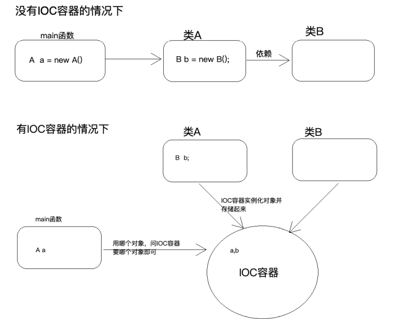
- 为什么叫控制反转
  - 控制：对象的创建（实例化，管理）的权利
  - 反转：控制权交给外部环境了（spring框架，Ioc容器）
#### IOC解决了什么问题
- 主要解决对象之间的耦合问题

- 不显示的指明使用的类，而是面向接口编程，由外部文件确定最终运行时使用的类
#### Ioc和Di的区别
- ioc和di（依赖注入）其实是同一件事情
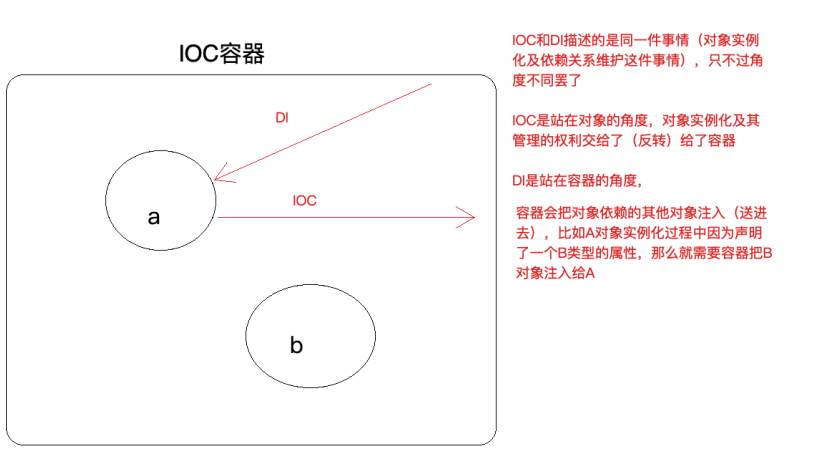
### AOP
### 什么是aop
- aop:aspect oriented Programming面向切面编程
- aop是oop的延续
  - oop有三大特征：封装，继承，多态
  - oop是一种垂直的体系
  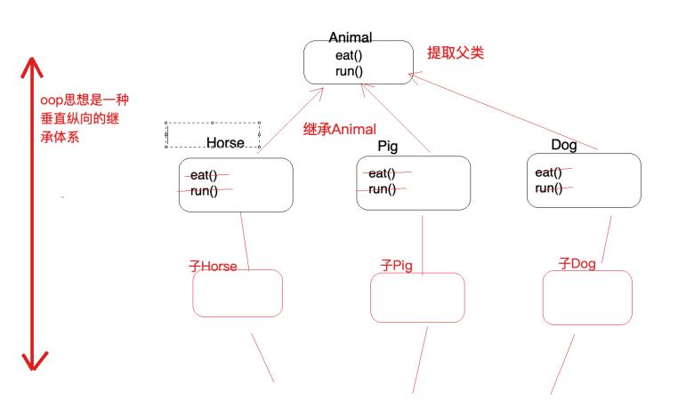
  - OOP编程思想可以解决⼤多数的代码重复问题，但是有⼀些情况是处理不了的，⽐如下⾯的在顶级⽗类Animal中的多个⽅法中相同位置出现了重复代码，OOP就解决不了
  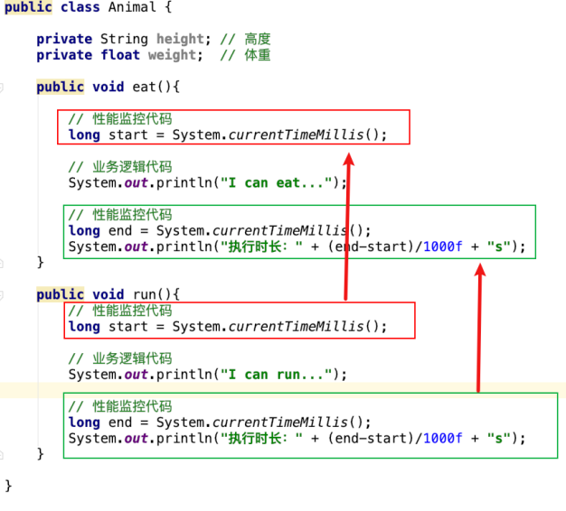
  - 横切逻辑代码
  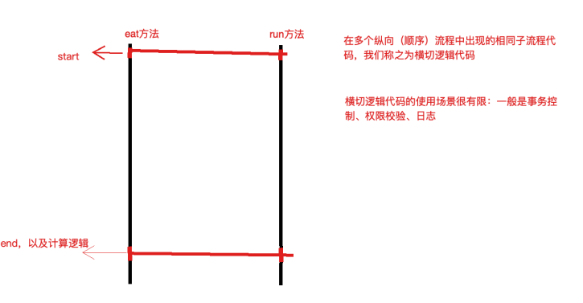
  - 横切逻辑代码存在什么问题？
  - 横切代码有重复的问题
  - 横切逻辑代码与业务代码放在一起，代码耦合高，不方便维护
### aop在解决什么问题
- 在不改变原有业务逻辑情况下，增强横切逻辑代码，根本上解耦合，避免横切逻辑代码重复
### 为什么叫面向切面编程
- 「切」：指的是横切逻辑，原有业务逻辑代码我们不能动，只能操作横切逻辑代码，所以⾯向横切逻辑
- 「⾯」：横切逻辑代码往往要影响的是很多个⽅法，每⼀个⽅法都如同⼀个点，多个点构成⾯，有⼀个
⾯的概念在⾥⾯
- 代码抽取
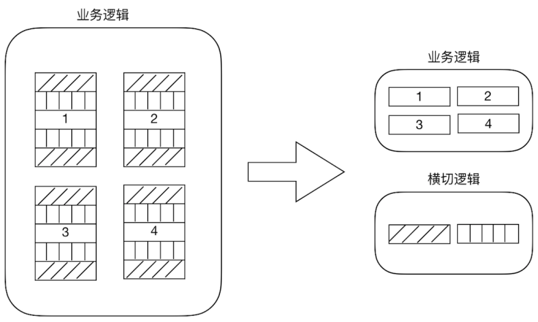

## 样例spring-transfer
- 转帐模块
- 流程
  - 打开spring-transfer的Plugins的tomcat7,运行tomcat7:run-war,会出现下面的界面
  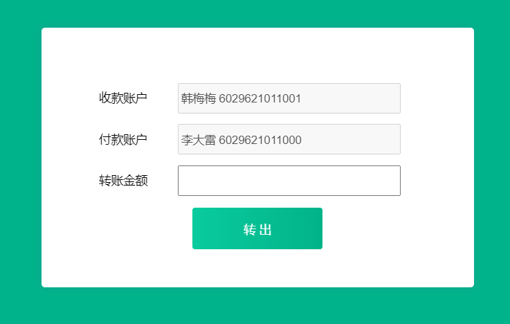
  - 点击发送会将参数封装起来，请求/transferServlet地址
  - httpServlet的子类会对其进行post处理
  ```java
  protected void doPost(HttpServletRequest req, HttpServletResponse resp)  {
          // 设置请求体的字符编码
          req.setCharacterEncoding("UTF-8");
          String fromCardNo = req.getParameter("fromCardNo");
          String toCardNo = req.getParameter("toCardNo");
          String moneyStr = req.getParameter("money");
          int money = Integer.parseInt(moneyStr);
          Result result = new Result();
          try {
              // 2. 调用service层方法
              transferService.transfer(fromCardNo,toCardNo,money);
              result.setStatus("200");
          } catch (Exception e) {
              e.printStackTrace();
              result.setStatus("201");
              result.setMessage(e.toString());
          }
          // 响应
          resp.setContentType("application/json;charset=utf-8");
          resp.getWriter().print(JsonUtils.object2Json(result));
     }
  ```
  - serviceImpl类会调用Dao的实现类进行业务实现
  - 更改数据表的相关信息
  
### 问题分析
  
  - （1）问题⼀：在上述案例实现中，service 层实现类在使⽤ dao 层对象时，直接在
    TransferServiceImpl 中通过 AccountDao accountDao = new JdbcAccountDaoImpl() 获得了 dao层对
    象，然⽽⼀个 new 关键字却将 TransferServiceImpl 和 dao 层具体的⼀个实现类
    JdbcAccountDaoImpl 耦合在了⼀起，如果说技术架构发⽣⼀些变动，dao 层的实现要使⽤其它技术，
    ⽐如 Mybatis，思考切换起来的成本？每⼀个 new 的地⽅都需要修改源代码，重新编译，⾯向接⼝开发
    的意义将⼤打折扣？ 
  - （2）问题⼆：service 层代码没有竟然还没有进⾏事务控制 ？！如果转账过程中出现异常，将可能导致
    数据库数据错乱，后果可能会很严重，尤其在⾦融业务
### 解决思路
- 针对问题⼀思考：
  - 实例化对象的⽅式除了 new 之外，还有什么技术？反射 (需要把类的全限定类名配置在xml
  中)
  - 考虑使⽤设计模式中的⼯⼚模式解耦合，另外项⽬中往往有很多对象需要实例化，那就在⼯⼚中使
  ⽤反 射技术实例化对象，⼯⼚模式很合适
  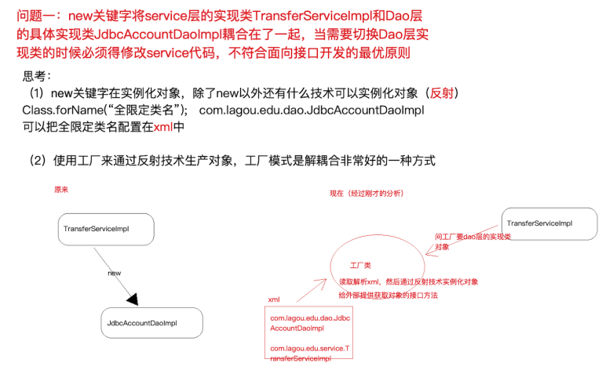
  - 更进⼀步，代码中能否只声明所需实例的接⼝类型，不出现 new 也不出现⼯⼚类的字眼，如下
    图？ 能！声明⼀个变量并提供 set ⽅法，在反射的时候将所需要的对象注⼊进去吧
- 针对问题二思考
  - service 层没有添加事务控制，怎么办？没有事务就添加上事务控制，⼿动控制 JDBC 的
    Connection 事务，但要注意将Connection和当前线程绑定（即保证⼀个线程只有⼀个
    Connection，这样操作才针对的是同⼀个 Connection，进⽽控制的是同⼀个事务） 
    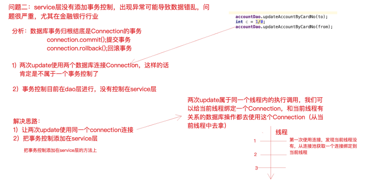 
  ```xml
  <?xml version="1.0" encoding="UTF-8" ?>
  <!--跟标签beans，里面配置一个又一个的bean子标签，每一个bean子标签都代表一个类的配置-->
  <beans>
      <!--id标识对象，class是类的全限定类名-->
      <bean id="accountDao" class="com.pyip.edu.dao.impl.JdbcTemplateDaoImpl">
          <property name="ConnectionUtils" ref="connectionUtils"/>
      </bean>
      <bean id="transferService" class="com.pyip.edu.service.impl.TransferServiceImpl">
          <!--set+ name 之后锁定到传值的set方法了，通过反射技术可以调用该方法传入对应的值-->
          <property name="AccountDao" ref="accountDao"></property>
      </bean>
      <!--配置新增的三个Bean-->
      <bean id="connectionUtils" class="com.pyip.edu.utils.ConnectionUtils"></bean>
      <!--事务管理器-->
      <bean id="transactionManager" class="com.pyip.edu.utils.TransactionManager">
          <property name="ConnectionUtils" ref="connectionUtils"/>
      </bean>
      <!--代理对象工厂-->
      <bean id="proxyFactory" class="com.pyip.edu.factory.ProxyFactory">
          <property name="TransactionManager" ref="transactionManager"/>
      </bean>
  </beans>
  ```
- 相关java核心类
  - ioc容器存储bean对象
    ```java
    // BeanFactory类
      /**
       * 任务一：读取解析xml，通过反射技术实例化对象并且存储待用（map集合）
       * 任务二：对外提供获取实例对象的接口（根据id获取）
       */
      private static Map<String,Object> map = new HashMap<>();  // 存储对象
      static {
          // 任务一：读取解析xml，通过反射技术实例化对象并且存储待用（map集合）
          // 加载xml
          InputStream resourceAsStream = BeanFactory.class.getClassLoader().getResourceAsStream("beans.xml");
          // 解析xml
          SAXReader saxReader = new SAXReader();
              Document document = saxReader.read(resourceAsStream);
              Element rootElement = document.getRootElement();
              List<Element> beanList = rootElement.selectNodes("//bean");
              for (int i = 0; i < beanList.size(); i++) {
                  Element element =  beanList.get(i);
                  // 处理每个bean元素，获取到该元素的id 和 class 属性
                  String id = element.attributeValue("id");        // accountDao
                  String clazz = element.attributeValue("class");  // com.lagou.edu.dao.impl.JdbcAccountDaoImpl
                  // 通过反射技术实例化对象
                  Class<?> aClass = Class.forName(clazz);
                  Object o = aClass.newInstance();  // 实例化之后的对象
                  // 存储到map中待用
                  map.put(id,o);
              }
              // 实例化完成之后维护对象的依赖关系，检查哪些对象需要传值进入，根据它的配置，我们传入相应的值
              // 有property子元素的bean就有传值需求（！！！这里是属性赋值）
              List<Element> propertyList = rootElement.selectNodes("//property");
              // 解析property，获取父元素
              for (int i = 0; i < propertyList.size(); i++) {
                  Element element =  propertyList.get(i);   //<property name="AccountDao" ref="accountDao"></property>
                  String name = element.attributeValue("name");
                  String ref = element.attributeValue("ref");
                  // 找到当前需要被处理依赖关系的bean
                  Element parent = element.getParent();
                  // 调用父元素对象的反射功能
                  String parentId = parent.attributeValue("id");
                  Object parentObject = map.get(parentId);
                  // 遍历父对象中的所有方法，找到"set" + name
                  Method[] methods = parentObject.getClass().getMethods();
                  for (int j = 0; j < methods.length; j++) {
                      Method method = methods[j];
                      if(method.getName().equalsIgnoreCase("set" + name)) {  // 该方法就是 setAccountDao(AccountDao accountDao)
                          method.invoke(parentObject,map.get(ref));
                      }
                  }
                  // 把处理之后的parentObject重新放到map中
                  map.put(parentId,parentObject);
              }
       // 任务二：对外提供获取实例对象的接口（根据id获取）
      public static  Object getBean(String id) {
          return map.get(id);
      }
    ```
  - jdk动态代理（aop横切逻辑）
    ```java
    public Object getJdkProxy(Object obj) {
            // 获取代理对象
            return  Proxy.newProxyInstance(obj.getClass().getClassLoader(), obj.getClass().getInterfaces(),
                    new InvocationHandler() {
                        @Override
                        public Object invoke(Object proxy, Method method, Object[] args) throws Throwable {
                            Object result = null;
                            try{
                                // 开启事务(关闭事务的自动提交)
                                transactionManager.beginTransaction();
                                result = method.invoke(obj,args);
                                // 提交事务
                                transactionManager.commit();
                            }catch (Exception e) {
                                e.printStackTrace();
                                // 回滚事务
                                transactionManager.rollback();
                                // 抛出异常便于上层servlet捕获
                                throw e;
                            }
                            return result;
                        }
                    });
        }
    ```
  
  - connection相关
    ```java
    // 连接工具包
    // 保证每一个线程只有一个连接，可进行事务的回滚
    public class ConnectionUtils {    
        private ThreadLocal<Connection> threadLocal = new ThreadLocal<>(); // 存储当前线程的连接
        // 从当前线程获取连接
        public Connection getCurrentThreadConn() throws SQLException {
            // 判断当前线程中是否已经绑定连接，如果没有绑定，需要从连接池获取一个连接绑定到当前线程
            Connection connection = threadLocal.get();
            if(connection == null) {
                // 从连接池拿连接并绑定到线程
                connection = DruidUtils.getInstance().getConnection();
                // 绑定到当前线程
                threadLocal.set(connection);
            }
            return connection;
        }
    }
    // 事务处理器
    public class TransactionManager {
        private ConnectionUtils connectionUtils;
        public void setConnectionUtils(ConnectionUtils connectionUtils) {
            this.connectionUtils = connectionUtils;
        }
        // 开启手动事务控制
        public void beginTransaction() throws SQLException {
            connectionUtils.getCurrentThreadConn().setAutoCommit(false);
        }
        // 提交事务
        public void commit() throws SQLException {
            connectionUtils.getCurrentThreadConn().commit();
        }
        // 回滚事务
        public void rollback() throws SQLException {
            connectionUtils.getCurrentThreadConn().rollback();
        }
    }
    
    ```
  - bean的获取相关
    ```java
        // 从工厂获取委托对象（委托对象是增强了事务控制的功能）
        // 首先从BeanFactory获取到proxyFactory代理工厂的实例化对象
        private ProxyFactory proxyFactory = (ProxyFactory) BeanFactory.getBean("proxyFactory");
        private TransferService transferService = (TransferService) proxyFactory.getJdkProxy(BeanFactory.getBean("transferService")) ;
        // transferService所执行的方法都会都代理对象的invoke方法，那里有横切逻辑内容
    
    ```
## spring ioc应用
### Spring ioc基础
#### BeanFactory与ApplicationContext的区别
BeanFactory是Spring框架中IoC容器的顶层接⼝,它只是⽤来定义⼀些基础功能,定义⼀些基础规范,⽽
ApplicationContext是它的⼀个⼦接⼝，所以ApplicationContext是具备BeanFactory提供的全部功能
的。
通常，我们称BeanFactory为SpringIOC的基础容器，ApplicationContext是容器的⾼级接⼝，⽐
BeanFactory要拥有更多的功能，⽐如说国际化⽀持和资源访问（xml，java配置类）等等
  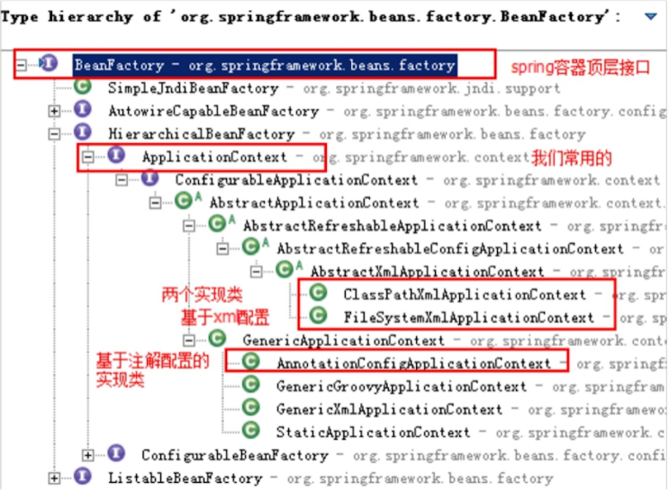
- 启动IoC容器的方式
  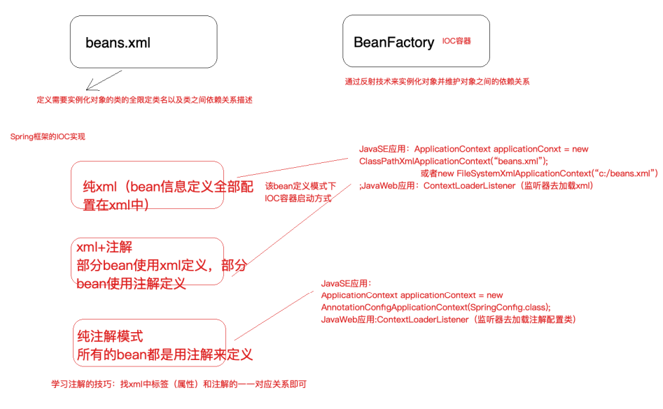
  - java环境下启动IoC容器
    - ClassPathXmlApplicationContext：从类的根路径下加载配置⽂件（推荐使⽤）
    - FileSystemXmlApplicationContext：从磁盘路径上加载配置⽂件
    - AnnotationConfigApplicationContext：纯注解模式下启动Spring容器
  - web环境下启动IoC容器
    - 从xml启动容器
      ```xml
      ```
    - 从配置类启动容器
      ```xml
      ```
#### 纯xml模式
本部分内容采⽤Spring IoC纯xml模式改造我们前⾯⼿写的IoC和AOP实现，在改造的过程中，把各个知识点串起来。

- 引入依赖并配置xml，将bean.xml改为applicationContext.xml

    ```xml
        <!--引入Spring IoC容器功能-->
        <dependency>
            <groupId>org.springframework</groupId>
            <artifactId>spring-context</artifactId>
            <version>5.1.12.RELEASE</version>
        </dependency>
      <?xml version="1.0" encoding="UTF-8"?>
    <!--配置app....xml文件的头信息，标签beans，里面配置一个又一个的bean子标签，每一个bean子标签都代表一个类的配置-->
    <beans xmlns="http://www.springframework.org/schema/beans"
           xmlns:xsi="http://www.w3.org/2001/XMLSchema-instance"
           xsi:schemaLocation="http://www.springframework.org/schema/beans
           https://www.springframework.org/schema/beans/spring-beans.xsd">
    ```

- 将所有的需要spring管理的bean注册到xml文件中，不用自己来管理

  ```xml
  <?xml version="1.0" encoding="UTF-8"?>
  <!--跟标签beans，里面配置一个又一个的bean子标签，每一个bean子标签都代表一个类的配置-->
  <beans xmlns="http://www.springframework.org/schema/beans"
         xmlns:xsi="http://www.w3.org/2001/XMLSchema-instance"
         xsi:schemaLocation="http://www.springframework.org/schema/beans
         https://www.springframework.org/schema/beans/spring-beans.xsd">
  
      <!--id标识对象，class是类的全限定类名-->
      <bean id="accountDao" class="com.pyip.edu.dao.impl.JdbcAccountDaoImpl">
      </bean>
      <bean id="transferService" class="com.pyip.edu.service.impl.TransferServiceImpl">
          <!--set+ name 之后锁定到传值的set方法了，通过反射技术可以调用该方法传入对应的值-->
          <property name="AccountDao" ref="accountDao"></property>
      </bean>
      <!--配置新增的三个Bean-->
      <bean id="connectionUtils" class="com.pyip.edu.utils.ConnectionUtils"></bean>
      <!--事务管理器-->
      <bean id="transactionManager" class="com.pyip.edu.utils.TransactionManager">
          <property name="connectionUtils" ref="connectionUtils"/>
      </bean>
      <!--代理对象工厂-->
      <bean id="proxyFactory" class="com.pyip.edu.factory.ProxyFactory">
          <property name="TransactionManager" ref="transactionManager"/>
      </bean>
      <bean id="accountPojo" class="com.pyip.edu.pojo.Account" lazy-init="true"/>
  </beans>
  ```

- 测试JavaSE模式成功，将所有的bean对象都交给spring来管理

  ```java
      @Test
      public void test(){
          // 通过读取classpath下的xml文件来启动容器（xml模式SE应用下推荐）
          ApplicationContext context = new ClassPathXmlApplicationContext("classpath:applicationContext.xml");
          // 不推荐使用
          //ApplicationContext applicationContext1 = new FileSystemXmlApplicationContext("文件系统的绝对路径");
          Object bean = context.getBean("accountDao");
          System.out.println(bean);//com.pyip.edu.dao.impl.JdbcAccountDaoImpl@4d3167f4
      }
  ```

- 测试Web模式

  ```xml
  <!--先引入依赖 -->
      <dependency>
        <groupId>org.springframework</groupId>
        <artifactId>spring-web</artifactId>
        <version>5.1.12.RELEASE</version>
      </dependency>
  <!--在webapp/WEB-INF/web.xml下配置数据 
      配置Spring ioc容器的配置文件-->
    <context-param>
      <param-name>contextConfigLocation</param-name>
      <param-value>classpath:applicationContext.xml</param-value>
    </context-param>
    <!--使用监听器启动Spring的IOC容器-->
    <listener>
      <listener-class>org.springframework.web.context.ContextLoaderListener</listener-class>
    </listener>
  ```

  在servlet中启动配置信息

  ```java
  private TransferService transferService = null ;
      @Override
      public void init() throws ServletException {
         WebApplicationContext webApplicationContext = WebApplicationContextUtils.getWebApplicationContext(this.getServletContext());
          ProxyFactory proxyFactory = (ProxyFactory)webApplicationContext.getBean("proxyFactory");
          transferService = (TransferService) proxyFactory.getJdkProxy(webApplicationContext.getBean("transferService")) ;
      }
  ```

##### 实例化bean的方式

- 方式一：使⽤⽆参构造函数 在默认情况下，它会通过反射调⽤⽆参构造函数来创建对象。如果类中没有⽆参构造函数，将创建 失败。

  ```xml
  <!--配置service对象-->
  <bean id="userService" class="com.lagou.service.impl.TransferServiceImpl"></bean>
  ```

- 方式二：使⽤静态⽅法创建 

  - 在实际开发中，我们使⽤的对象有些时候并不是直接通过构造函数就可以创建出来的，它可能在创 建的过程 中会做很多额外的操作。此时会提供⼀个创建对象的⽅法，恰好这个⽅法是static修饰的 ⽅法，即是此种情 况。 

  - 例如，我们在做Jdbc操作时，会⽤到java.sql.Connection接⼝的实现类，如果是mysql数据库，那 么⽤的就 是JDBC4Connection，但是我们不会去写 JDBC4Connection connection = new JDBC4Connection() ，因 为我们要注册驱动，还要提供URL和凭证信息， ⽤ DriverManager.getConnection ⽅法来获取连接。   

  - contextConfigLocation com.lagou.edu.SpringConfig    org.springframework.web.context.ContextLoaderListener     那么在实际开发中，尤其早期的项⽬没有使⽤Spring框架来管理对象的创建，但是在设计时使⽤了 ⼯⼚模式 解耦，那么当接⼊spring之后，⼯⼚类创建对象就具有和上述例⼦相同特征，即可采⽤ 此种⽅式配置。

    ```xml
    <!--使⽤静态⽅法创建对象的配置⽅式-->
    <bean id="connectionUtils" class="com.lagou.edu.factory.CreateBeanFactory" factory-method="getInstanceStatic"/>
    public static ConnectionUtils getInstanceStatic() {return new ConnectionUtils();}
    ```

    

- 方式三：使用实例化方式创建

  ```xml
  <bean id="createBeanFactory" class="com.lagou.edu.factory.CreateBeanFactory"></bean>
  <bean id="connectionUtils" factory-bean="createBeanFactory" factory-method="getInstance"/>
  public ConnectionUtils getInstance() {return new ConnectionUtils();}
  ```

  

##### bean的生命周期

- 生命周期与作用范围

  - 作用范围的改变。在spring框架管理Bean对象的创建时，Bean对象默认都是单例的，但是它⽀持配置的⽅式改 变作⽤范围

    ```xml
    <bean id="accountDao" class="com.lagou.edu.dao.impl.JdbcAccountDaoImpl" scope="singleton"/>
    ```

  - 不同作⽤范围的⽣命周期

- 常见模式

  - 单例模式：singleton
    - 对象出⽣：当创建容器时，对象就被创建了。 
    - 对象活着：只要容器在，对象⼀直活着。 
    - 对象死亡：当销毁容器时，对象就被销毁了。 ⼀句话总结：单例模式的bean对象⽣命周期与容器相同。

  - 多例模式：prototype
    -  对象出⽣：当使⽤对象时，创建新的对象实例。
    -  对象活着：只要对象在使⽤中，就⼀直活着。
    -  对象死亡：当对象⻓时间不⽤时，被java的垃圾回收器回收了。 ⼀句话总结：多例模式的bean对象，spring框架只负责创建，不负责销毁。

- bean标签属性
  - 在基于xml的IoC配置中，bean标签是最基础的标签。它表示了IoC容器中的⼀个对象。换句话 说，如果⼀个对象想让spring管理，在XML的配置中都需要使⽤此标签配置，Bean标签的属性如下
    - id属性： ⽤于给bean提供⼀个唯⼀标识。在⼀个标签内部，标识必须唯⼀。
    -  class属性：⽤于指定创建Bean对象的全限定类名。
    -  name属性：⽤于给bean提供⼀个或多个名称。多个名称⽤空格分隔。 
    - factory-bean属性：⽤于指定创建当前bean对象的⼯⼚bean的唯⼀标识。当指定了此属性之后， class属性失效。
    -  factory-method属性：⽤于指定创建当前bean对象的⼯⼚⽅法，如配合factory-bean属性使⽤， 则class属性失效。如配合class属性使⽤，则⽅法必须是static的。
    -  scope属性：⽤于指定bean对象的作⽤范围。通常情况下就是singleton。当要⽤到多例模式时， 可以配置为prototype。 
    - init-method属性：⽤于指定bean对象的初始化⽅法，此⽅法会在bean对象装配后调⽤。必须是 ⼀个⽆参⽅法。
    -  destory-method属性：⽤于指定bean对象的销毁⽅法，此⽅法会在bean对象销毁前执⾏。它只 能为scope是singleton时起作⽤。

- DI依赖注入的xml配置

  - 依赖注入分类
    - 按照注入的方式
      - 构造函数
      - set方法
    - 按照注入的数据类型
      - 基本类型与String
      - 其他bean类型
      - 复杂类型（注入的数据类型是Array,List,Set,Properties,Map）

  - 依赖注⼊的配置实现之构造函数注⼊ 顾名思义，就是利⽤构造函数实现对类成员的赋值。它 的使⽤要求是，类中提供的构造函数参数个数必须和配置的参数个数⼀致，且数据类型匹 配。同时需要注意的是，当没有⽆参构造时，则必须提供构造函数参数的注⼊，否则Spring 框架会报错。

    ```xml
    <bean id="accountDao" class="com.lagou.edu.dao.impl.JdbcAccountDaoImpl" scope="singleton" init-method="init" destroy-method="destory">
            <!--set注入使用property标签，如果注入的是另外一个bean那么使用ref属性，如果注入的是普通值那么使用的是value属性-->
            <!--<property name="ConnectionUtils" ref="connectionUtils"/>
            <property name="name" value="zhangsan"/>
            <property name="sex" value="1"/>
            <property name="money" value="100.3"/>-->
        
            <!--<constructor-arg index="0" ref="connectionUtils"/>
            <constructor-arg index="1" value="zhangsan"/>
            <constructor-arg index="2" value="1"/>
            <constructor-arg index="3" value="100.5"/>-->
    
            <!--name：按照参数名称注入，index按照参数索引位置注入-->
            <constructor-arg name="connectionUtils" ref="connectionUtils"/>
            <constructor-arg name="name" value="zhangsan"/>
            <constructor-arg name="sex" value="1"/>
            <constructor-arg name="money" value="100.6"/>
    </bean>
    <!-- 
        public JdbcAccountDaoImpl(ConnectionUtils connectionUtils, String name, int sex, float money) {
            this.connectionUtils = connectionUtils;
            this.name = name;
            this.sex = sex;
            this.money = money;
        }
    -->
    ```

    ```xml
    <bean id="accountDao" class="com.lagou.edu.dao.impl.JdbcAccountDaoImpl" scope="singleton" init-method="init" destroy-method="destory">
            <!--set注入注入复杂数据类型-->
            <property name="myArray">
                <array>
                    <value>array1</value>
                    <value>array2</value>
                    <value>array3</value>
                </array>
            </property>
            <property name="myMap">
                <map>
                    <entry key="key1" value="value1"/>
                    <entry key="key2" value="value2"/>
                </map>
            </property>
            <property name="mySet">
                <set>
                    <value>set1</value>
                    <value>set2</value>
                </set>
            </property>
            <property name="myProperties">
                <props>
                    <prop key="prop1">value1</prop>
                    <prop key="prop2">value2</prop>
                </props>
            </property>
        </bean>
    <!-- 
        private String[] myArray;
        private Map<String,String> myMap;
        private Set<String> mySet;
        private Properties myProperties;
    ...setter方法
    -->
    ```

#### xml+注解模式
- 注意：
  - 1）实际企业开发中，纯xml模式使⽤已经很少了
  - 2）引⼊注解功能，不需要引⼊额外的jar
  - 3）xml+注解结合模式，xml⽂件依然存在，所以，spring IOC容器的启动仍然从加载xml开始
  - 4）哪些bean的定义写在xml中，哪些bean的定义使⽤注解
  - 第三⽅jar中的bean定义在xml，⽐如德鲁伊数据库连接池，⾃⼰开发的bean定义使⽤注解
##### DI依赖注入的注解实现方式
- @Autowired（推荐使⽤） @Autowired为Spring提供的注解，需要导⼊包org.springframework.beans.factory.annotation.Autowired。
  - @Autowired采取的策略为按照类型注⼊。
  ```java
  @Service("transferService")
  public class TransferServiceImpl implements TransferService {
    // 最佳状态
    // @Autowired 按照类型注入 ,如果按照类型无法唯一锁定对象，可以结合@Qualifier指定具体的id
    @Autowired
    @Qualifier("accountDao")
    private AccountDao accountDao;
  }
  ```
- @Resource @Resource 注解由 J2EE 提供，需要导⼊包javax.annotation.Resource,
  - @Resource 默认按照 ByName ⾃动注⼊。
  ```java
  public class TransferService {
  @Resource
  private AccountDao accountDao;
  @Resource(name="studentDao")
  private StudentDao studentDao;
  @Resource(type="TeacherDao")
  private TeacherDao teacherDao;
  @Resource(name="manDao",type="ManDao")
  private ManDao manDao;
  }
  /* 引入jar包
  <dependency>
    <groupId>javax.annotation</groupId>
    <artifactId>javax.annotation-api</artifactId>
    <version>1.3.2</version>
  </dependency>
  */
  ```
  - 如果同时指定了 name 和 type，则从Spring上下⽂中找到唯⼀匹配的bean进⾏装配，找不
    到则抛出异常。
  - 如果指定了 name，则从上下⽂中查找名称（id）匹配的bean进⾏装配，找不到则抛出异
    常。
  - 如果指定了 type，则从上下⽂中找到类似匹配的唯⼀bean进⾏装配，找不到或是找到多个，
    都会抛出异常。
  - 如果既没有指定name，⼜没有指定type，则⾃动按照byName⽅式进⾏装配；

#### 纯注解模式

- 改造xm+注解模式，将xml中遗留的内容全部以注解的形式迁移出去，最终删除xml，从Java配置类启动 
- 对应注解 
  - @Configuration 注解，表名当前类是⼀个配置类 @ComponentScan 注解，替代 context:component-scan
  - @PropertySource，引⼊外部属性配置⽂件
  - @Import 引⼊其他配置类 
  - @Value 对变量赋值，可以直接赋值，也可以使⽤ ${} 读取资源配置⽂件中的信息 
  - @Bean 将⽅法返回对象加⼊ SpringIOC 容器

### Sping Ioc高级特性

#### lazy-Init 延迟加载

- ApplicationContext 容器的默认⾏为是在启动服务器时将所有 singleton bean 提前进⾏实例化。提前 实例化意味着作为初始化过程的⼀部分，ApplicationContext 实例会创建并配置所有的singleton bean。

  ```xml
  <bean id="testBean" class="cn.lagou.LazyBean" />
  <!--该bean默认的设置为:lazy-init="false"，⽴即加载，表示在spring启动时，⽴刻进⾏实例化。
  反之 lazy-init="true"-->
  <bean id="testBean" calss="cn.lagou.LazyBean" lazy-init="false" />
  ```

- 设置 lazy-init 为 true 的 bean 将不会在 ApplicationContext 启动时提前被实例化，⽽是第⼀次向容器 通过 getBean 索取 bean 时实例化的。

-  如果⼀个设置了⽴即加载的 bean1，引⽤了⼀个延迟加载的 bean2 ，那么 bean1 在容器启动时被实例 化，⽽ bean2 由于被 bean1 引⽤，所以也被实例化，这种情况也符合延时加载的 bean 在第⼀次调⽤ 时才被实例化的规则。

-  也可以在容器层次中通过在 元素上使⽤ "default-lazy-init" 属性来控制延时初始化

  ```xml
  <beans default-lazy-init="true">
   <!-- no beans will be eagerly pre-instantiated... -->
  </beans>
  ```

- 如果⼀个 bean 的 scope 属性为 scope="pototype" 时，即使设置了 lazy-init="false"，容器启动时也不 会实例化bean，⽽是调⽤ getBean ⽅法实例化的。

##### 应用场景

- （1）开启延迟加载⼀定程度提⾼容器启动和运转性能 该bean默认的设置为:    
- （2）对于不常使⽤的 Bean 设置延迟加载，这样偶尔使⽤的时候再加载，不必要从⼀开始该 Bean 就占 ⽤资源

#### BeanFactory和FactoryBean

- BeanFactory接⼝是容器的顶级接⼝，定义了容器的⼀些基础⾏为，负责⽣产和管理Bean的⼀个⼯⼚， 具体使⽤它下⾯的⼦接⼝类型，⽐如ApplicationContext；此处我们重点分析FactoryBean

- Spring中Bean有两种，⼀种是普通Bean，⼀种是⼯⼚Bean（FactoryBean），FactoryBean可以⽣成 某⼀个类型的Bean实例（返回给我们），也就是说我们可以借助于它⾃定义Bean的创建过程。 Bean创建的三种⽅式中的静态⽅法和实例化⽅法和FactoryBean作⽤类似，FactoryBean使⽤较多，尤 其在Spring框架⼀些组件中会使⽤，还有其他框架和Spring框架整合时使⽤

  ```java
  // 可以让我们⾃定义Bean的创建过程（完成复杂Bean的定义）
  public interface FactoryBean<T> {
   @Nullable
   // 返回FactoryBean创建的Bean实例，如果isSingleton返回true，则该实例会放到Spring容器
  的单例对象缓存池中Map
   T getObject() throws Exception;
   @Nullable
   // 返回FactoryBean创建的Bean类型
   Class<?> getObjectType();
   // 返回作⽤域是否单例
   default boolean isSingleton() {
   return true;
   }
  }
  ```

- example

  ```java
  public class Company {
   private String name;
   private String address;
   private int scale;
      // getter...setter
  }
  public class CompanyFactoryBean implements FactoryBean<Company> {
   private String companyInfo; // 公司名称,地址,规模
   public void setCompanyInfo(String companyInfo) {
   	this.companyInfo = companyInfo;
    }
   @Override
   public Company getObject() throws Exception {
   // 模拟创建复杂对象Company
   	Company company = new Company();
   	String[] strings = companyInfo.split(",");
   	company.setName(strings[0]);
   	company.setAddress(strings[1]);
   	company.setScale(Integer.parseInt(strings[2]));
   	return company;
   }
   @Override
   public Class<?> getObjectType() {
   	return Company.class;
   }
   @Override
   public boolean isSingleton() {
   	return true;
   }
  }
  
  ```

  ```xml
  <bean id="companyBean" class="com.lagou.edu.factory.CompanyFactoryBean">
   <property name="companyInfo" value="拉勾,中关村,500"/>
  </bean>
  ```

  - 测试结果

    ```java
    Object companyBean = applicationContext.getBean("companyBean");
    System.out.println("bean:" + companyBean);// bean:Company{name='拉勾', address='中关村', scale=500}
    Object companyBean = applicationContext.getBean("&companyBean");
    System.out.println("bean:" + companyBean);// bean:com.lagou.edu.factory.CompanyFactoryBean@53f6fd09
    ```

    

#### 后置处理器

- Spring提供了两种后处理bean的扩展接⼝，分别为 BeanPostProcessor 和 BeanFactoryPostProcessor，两者在使⽤上是有所区别的。 
- ⼯⼚初始化（BeanFactory）—> Bean对象 在BeanFactory初始化之后可以使⽤BeanFactoryPostProcessor进⾏后置处理做⼀些事情 
- 在Bean对象实例化（并不是Bean的整个⽣命周期完成）之后可以使⽤BeanPostProcessor进⾏后置处 理做⼀些事情 
  - 注意：对象不⼀定是springbean，⽽springbean⼀定是个对象

##### BeanPostProcessor

BeanPostProcessor是针对Bean级别的处理，可以针对某个具体的Bean.

    ```java
    // 注意：处理是发⽣在Spring容器的实例化和依赖注⼊之后。
    public interface BeanPostProcessor {
        // 具体这个初始化⽅法指的是什么⽅法，类似我们在定义bean时，定义了init-method所指定的⽅法
        // 分别在Bean的初始化⽅法前执⾏
        @Nullable
        default Object postProcessBeforeInitialization(Object bean, String beanName) throws BeansException {
            return bean;
        }
        // 分别在Bean的初始化⽅法后执⾏
        @Nullable
        default Object postProcessAfterInitialization(Object bean, String beanName) throws BeansException {
            return bean;
        }
    }
    ```

##### BeanFactoryPostProcessor

BeanFactory级别的处理，是针对整个Bean的⼯⼚进⾏处理，典型应 ⽤:PropertyPlaceholderConfigure(用来替换${driver.username}等点位信息)

```java
@FunctionalInterface
public interface BeanFactoryPostProcessor {
    void postProcessBeanFactory(ConfigurableListableBeanFactory var1) throws BeansException;
}
```

- BeanDefinition对象：我们在 XML 中定义的 bean标签，Spring 解析 bean 标签成为⼀个 JavaBean， 这个JavaBean 就是 BeanDefinition 
  - 注意：调⽤ BeanFactoryPostProcessor ⽅法时，这时候bean还没有实例化，此时 bean 刚被解析成 BeanDefinition对象

