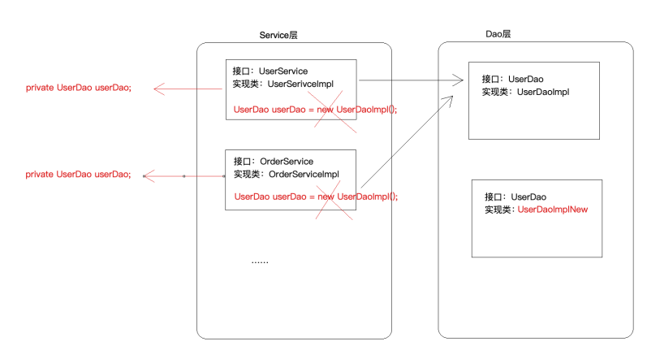
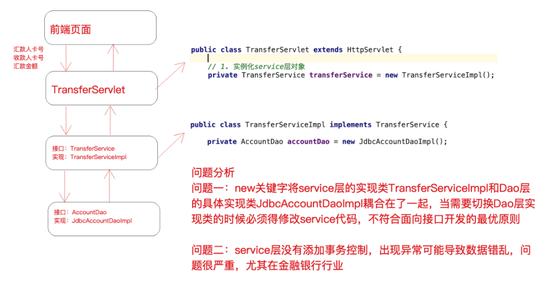

# spring-show
spring的源码学习
## spring核心思想
### IOC
#### 什么是IOC？
- ioc是控制反转，它是一个技术思想，不是一个技术实现
- 描述的事情：java开发领域对象的创建，管理的问题
- 传统开发方式与IOC思想下的开发方式

- 为什么叫控制反转
  - 控制：对象的创建（实例化，管理）的权利
  - 反转：控制权交给外部环境了（spring框架，Ioc容器）
#### IOC解决了什么问题
- 主要解决对象之间的耦合问题

- 不显示的指明使用的类，而是面向接口编程，由外部文件确定最终运行时使用的类
#### Ioc和Di的区别
- ioc和di（依赖注入）其实是同一件事情

### AOP
### 什么是aop
- aop:aspect oriented Programming面向切面编程
- aop是oop的延续
  - oop有三大特征：封装，继承，多态
  - oop是一种垂直的体系
  
  - OOP编程思想可以解决⼤多数的代码重复问题，但是有⼀些情况是处理不了的，⽐如下⾯的在顶级⽗类Animal中的多个⽅法中相同位置出现了重复代码，OOP就解决不了
  
  - 横切逻辑代码
  
  - 横切逻辑代码存在什么问题？
  - 横切代码有重复的问题
  - 横切逻辑代码与业务代码放在一起，代码耦合高，不方便维护
### aop在解决什么问题
- 在不改变原有业务逻辑情况下，增强横切逻辑代码，根本上解耦合，避免横切逻辑代码重复
### 为什么叫面向切面编程
- 「切」：指的是横切逻辑，原有业务逻辑代码我们不能动，只能操作横切逻辑代码，所以⾯向横切逻辑
- 「⾯」：横切逻辑代码往往要影响的是很多个⽅法，每⼀个⽅法都如同⼀个点，多个点构成⾯，有⼀个
⾯的概念在⾥⾯
- 代码抽取


## 样例spring-transfer
- 转帐模块
- 流程
  - 打开spring-transfer的Plugins的tomcat7,运行tomcat7:run-war,会出现下面的界面
  
  - 点击发送会将参数封装起来，请求/transferServlet地址
  - httpServlet的子类会对其进行post处理
  ```java
  protected void doPost(HttpServletRequest req, HttpServletResponse resp)  {
          // 设置请求体的字符编码
          req.setCharacterEncoding("UTF-8");
          String fromCardNo = req.getParameter("fromCardNo");
          String toCardNo = req.getParameter("toCardNo");
          String moneyStr = req.getParameter("money");
          int money = Integer.parseInt(moneyStr);
          Result result = new Result();
          try {
              // 2. 调用service层方法
              transferService.transfer(fromCardNo,toCardNo,money);
              result.setStatus("200");
          } catch (Exception e) {
              e.printStackTrace();
              result.setStatus("201");
              result.setMessage(e.toString());
          }
          // 响应
          resp.setContentType("application/json;charset=utf-8");
          resp.getWriter().print(JsonUtils.object2Json(result));
     }
  ```
  - serviceImpl类会调用Dao的实现类进行业务实现
  - 更改数据表的相关信息
  
### 问题分析
  
  - （1）问题⼀：在上述案例实现中，service 层实现类在使⽤ dao 层对象时，直接在
    TransferServiceImpl 中通过 AccountDao accountDao = new JdbcAccountDaoImpl() 获得了 dao层对
    象，然⽽⼀个 new 关键字却将 TransferServiceImpl 和 dao 层具体的⼀个实现类
    JdbcAccountDaoImpl 耦合在了⼀起，如果说技术架构发⽣⼀些变动，dao 层的实现要使⽤其它技术，
    ⽐如 Mybatis，思考切换起来的成本？每⼀个 new 的地⽅都需要修改源代码，重新编译，⾯向接⼝开发
    的意义将⼤打折扣？ 
  - （2）问题⼆：service 层代码没有竟然还没有进⾏事务控制 ？！如果转账过程中出现异常，将可能导致
    数据库数据错乱，后果可能会很严重，尤其在⾦融业务
### 解决思路
- 针对问题⼀思考：
  - 实例化对象的⽅式除了 new 之外，还有什么技术？反射 (需要把类的全限定类名配置在xml
  中)
  - 考虑使⽤设计模式中的⼯⼚模式解耦合，另外项⽬中往往有很多对象需要实例化，那就在⼯⼚中使
  ⽤反 射技术实例化对象，⼯⼚模式很合适
  
  - 更进⼀步，代码中能否只声明所需实例的接⼝类型，不出现 new 也不出现⼯⼚类的字眼，如下
    图？ 能！声明⼀个变量并提供 set ⽅法，在反射的时候将所需要的对象注⼊进去吧
- 针对问题二思考
  - service 层没有添加事务控制，怎么办？没有事务就添加上事务控制，⼿动控制 JDBC 的
    Connection 事务，但要注意将Connection和当前线程绑定（即保证⼀个线程只有⼀个
    Connection，这样操作才针对的是同⼀个 Connection，进⽽控制的是同⼀个事务） 
     
  ```xml
  <?xml version="1.0" encoding="UTF-8" ?>
  <!--跟标签beans，里面配置一个又一个的bean子标签，每一个bean子标签都代表一个类的配置-->
  <beans>
      <!--id标识对象，class是类的全限定类名-->
      <bean id="accountDao" class="com.pyip.edu.dao.impl.JdbcTemplateDaoImpl">
          <property name="ConnectionUtils" ref="connectionUtils"/>
      </bean>
      <bean id="transferService" class="com.pyip.edu.service.impl.TransferServiceImpl">
          <!--set+ name 之后锁定到传值的set方法了，通过反射技术可以调用该方法传入对应的值-->
          <property name="AccountDao" ref="accountDao"></property>
      </bean>
      <!--配置新增的三个Bean-->
      <bean id="connectionUtils" class="com.pyip.edu.utils.ConnectionUtils"></bean>
      <!--事务管理器-->
      <bean id="transactionManager" class="com.pyip.edu.utils.TransactionManager">
          <property name="ConnectionUtils" ref="connectionUtils"/>
      </bean>
      <!--代理对象工厂-->
      <bean id="proxyFactory" class="com.pyip.edu.factory.ProxyFactory">
          <property name="TransactionManager" ref="transactionManager"/>
      </bean>
  </beans>
  ```
- 相关java核心类
  - ioc容器存储bean对象
    ```java
    // BeanFactory类
      /**
       * 任务一：读取解析xml，通过反射技术实例化对象并且存储待用（map集合）
       * 任务二：对外提供获取实例对象的接口（根据id获取）
       */
      private static Map<String,Object> map = new HashMap<>();  // 存储对象
      static {
          // 任务一：读取解析xml，通过反射技术实例化对象并且存储待用（map集合）
          // 加载xml
          InputStream resourceAsStream = BeanFactory.class.getClassLoader().getResourceAsStream("beans.xml");
          // 解析xml
          SAXReader saxReader = new SAXReader();
              Document document = saxReader.read(resourceAsStream);
              Element rootElement = document.getRootElement();
              List<Element> beanList = rootElement.selectNodes("//bean");
              for (int i = 0; i < beanList.size(); i++) {
                  Element element =  beanList.get(i);
                  // 处理每个bean元素，获取到该元素的id 和 class 属性
                  String id = element.attributeValue("id");        // accountDao
                  String clazz = element.attributeValue("class");  // com.lagou.edu.dao.impl.JdbcAccountDaoImpl
                  // 通过反射技术实例化对象
                  Class<?> aClass = Class.forName(clazz);
                  Object o = aClass.newInstance();  // 实例化之后的对象
                  // 存储到map中待用
                  map.put(id,o);
              }
              // 实例化完成之后维护对象的依赖关系，检查哪些对象需要传值进入，根据它的配置，我们传入相应的值
              // 有property子元素的bean就有传值需求（！！！这里是属性赋值）
              List<Element> propertyList = rootElement.selectNodes("//property");
              // 解析property，获取父元素
              for (int i = 0; i < propertyList.size(); i++) {
                  Element element =  propertyList.get(i);   //<property name="AccountDao" ref="accountDao"></property>
                  String name = element.attributeValue("name");
                  String ref = element.attributeValue("ref");
                  // 找到当前需要被处理依赖关系的bean
                  Element parent = element.getParent();
                  // 调用父元素对象的反射功能
                  String parentId = parent.attributeValue("id");
                  Object parentObject = map.get(parentId);
                  // 遍历父对象中的所有方法，找到"set" + name
                  Method[] methods = parentObject.getClass().getMethods();
                  for (int j = 0; j < methods.length; j++) {
                      Method method = methods[j];
                      if(method.getName().equalsIgnoreCase("set" + name)) {  // 该方法就是 setAccountDao(AccountDao accountDao)
                          method.invoke(parentObject,map.get(ref));
                      }
                  }
                  // 把处理之后的parentObject重新放到map中
                  map.put(parentId,parentObject);
              }
       // 任务二：对外提供获取实例对象的接口（根据id获取）
      public static  Object getBean(String id) {
          return map.get(id);
      }
    ```
  - jdk动态代理（aop横切逻辑）
    ```java
    public Object getJdkProxy(Object obj) {
            // 获取代理对象
            return  Proxy.newProxyInstance(obj.getClass().getClassLoader(), obj.getClass().getInterfaces(),
                    new InvocationHandler() {
                        @Override
                        public Object invoke(Object proxy, Method method, Object[] args) throws Throwable {
                            Object result = null;
                            try{
                                // 开启事务(关闭事务的自动提交)
                                transactionManager.beginTransaction();
                                result = method.invoke(obj,args);
                                // 提交事务
                                transactionManager.commit();
                            }catch (Exception e) {
                                e.printStackTrace();
                                // 回滚事务
                                transactionManager.rollback();
                                // 抛出异常便于上层servlet捕获
                                throw e;
                            }
                            return result;
                        }
                    });
        }
    ```
  
  - connection相关
    ```java
    // 连接工具包
    // 保证每一个线程只有一个连接，可进行事务的回滚
    public class ConnectionUtils {    
        private ThreadLocal<Connection> threadLocal = new ThreadLocal<>(); // 存储当前线程的连接
        // 从当前线程获取连接
        public Connection getCurrentThreadConn() throws SQLException {
            // 判断当前线程中是否已经绑定连接，如果没有绑定，需要从连接池获取一个连接绑定到当前线程
            Connection connection = threadLocal.get();
            if(connection == null) {
                // 从连接池拿连接并绑定到线程
                connection = DruidUtils.getInstance().getConnection();
                // 绑定到当前线程
                threadLocal.set(connection);
            }
            return connection;
        }
    }
    // 事务处理器
    public class TransactionManager {
        private ConnectionUtils connectionUtils;
        public void setConnectionUtils(ConnectionUtils connectionUtils) {
            this.connectionUtils = connectionUtils;
        }
        // 开启手动事务控制
        public void beginTransaction() throws SQLException {
            connectionUtils.getCurrentThreadConn().setAutoCommit(false);
        }
        // 提交事务
        public void commit() throws SQLException {
            connectionUtils.getCurrentThreadConn().commit();
        }
        // 回滚事务
        public void rollback() throws SQLException {
            connectionUtils.getCurrentThreadConn().rollback();
        }
    }
    
    ```
  - bean的获取相关
    ```java
        // 从工厂获取委托对象（委托对象是增强了事务控制的功能）
        // 首先从BeanFactory获取到proxyFactory代理工厂的实例化对象
        private ProxyFactory proxyFactory = (ProxyFactory) BeanFactory.getBean("proxyFactory");
        private TransferService transferService = (TransferService) proxyFactory.getJdkProxy(BeanFactory.getBean("transferService")) ;
        // transferService所执行的方法都会都代理对象的invoke方法，那里有横切逻辑内容
    
    ```
## spring ioc应用
### Spring ioc基础
#### BeanFactory与ApplicationContext的区别
BeanFactory是Spring框架中IoC容器的顶层接⼝,它只是⽤来定义⼀些基础功能,定义⼀些基础规范,⽽
ApplicationContext是它的⼀个⼦接⼝，所以ApplicationContext是具备BeanFactory提供的全部功能
的。
通常，我们称BeanFactory为SpringIOC的基础容器，ApplicationContext是容器的⾼级接⼝，⽐
BeanFactory要拥有更多的功能，⽐如说国际化⽀持和资源访问（xml，java配置类）等等
  
- 启动IoC容器的方式
  
  - java环境下启动IoC容器
    - ClassPathXmlApplicationContext：从类的根路径下加载配置⽂件（推荐使⽤）
    - FileSystemXmlApplicationContext：从磁盘路径上加载配置⽂件
    - AnnotationConfigApplicationContext：纯注解模式下启动Spring容器
  - web环境下启动IoC容器
    - 从xml启动容器
      ```xml
      ```
    - 从配置类启动容器
      ```xml
      ```
#### 纯xml模式
本部分内容采⽤Spring IoC纯xml模式改造我们前⾯⼿写的IoC和AOP实现，在改造的过程中，把各个知识点串起来。

- 引入依赖并配置xml，将bean.xml改为applicationContext.xml

    ```xml
        <!--引入Spring IoC容器功能-->
        <dependency>
            <groupId>org.springframework</groupId>
            <artifactId>spring-context</artifactId>
            <version>5.1.12.RELEASE</version>
        </dependency>
      <?xml version="1.0" encoding="UTF-8"?>
    <!--配置app....xml文件的头信息，标签beans，里面配置一个又一个的bean子标签，每一个bean子标签都代表一个类的配置-->
    <beans xmlns="http://www.springframework.org/schema/beans"
           xmlns:xsi="http://www.w3.org/2001/XMLSchema-instance"
           xsi:schemaLocation="http://www.springframework.org/schema/beans
           https://www.springframework.org/schema/beans/spring-beans.xsd">
    ```

- 将所有的需要spring管理的bean注册到xml文件中，不用自己来管理

  ```xml
  <?xml version="1.0" encoding="UTF-8"?>
  <!--跟标签beans，里面配置一个又一个的bean子标签，每一个bean子标签都代表一个类的配置-->
  <beans xmlns="http://www.springframework.org/schema/beans"
         xmlns:xsi="http://www.w3.org/2001/XMLSchema-instance"
         xsi:schemaLocation="http://www.springframework.org/schema/beans
         https://www.springframework.org/schema/beans/spring-beans.xsd">
  
      <!--id标识对象，class是类的全限定类名-->
      <bean id="accountDao" class="com.pyip.edu.dao.impl.JdbcAccountDaoImpl">
      </bean>
      <bean id="transferService" class="com.pyip.edu.service.impl.TransferServiceImpl">
          <!--set+ name 之后锁定到传值的set方法了，通过反射技术可以调用该方法传入对应的值-->
          <property name="AccountDao" ref="accountDao"></property>
      </bean>
      <!--配置新增的三个Bean-->
      <bean id="connectionUtils" class="com.pyip.edu.utils.ConnectionUtils"></bean>
      <!--事务管理器-->
      <bean id="transactionManager" class="com.pyip.edu.utils.TransactionManager">
          <property name="connectionUtils" ref="connectionUtils"/>
      </bean>
      <!--代理对象工厂-->
      <bean id="proxyFactory" class="com.pyip.edu.factory.ProxyFactory">
          <property name="TransactionManager" ref="transactionManager"/>
      </bean>
      <bean id="accountPojo" class="com.pyip.edu.pojo.Account" lazy-init="true"/>
  </beans>
  ```

- 测试JavaSE模式成功，将所有的bean对象都交给spring来管理

  ```java
      @Test
      public void test(){
          // 通过读取classpath下的xml文件来启动容器（xml模式SE应用下推荐）
          ApplicationContext context = new ClassPathXmlApplicationContext("classpath:applicationContext.xml");
          // 不推荐使用
          //ApplicationContext applicationContext1 = new FileSystemXmlApplicationContext("文件系统的绝对路径");
          Object bean = context.getBean("accountDao");
          System.out.println(bean);//com.pyip.edu.dao.impl.JdbcAccountDaoImpl@4d3167f4
      }
  ```

- 测试Web模式

  ```xml
  <!--先引入依赖 -->
      <dependency>
        <groupId>org.springframework</groupId>
        <artifactId>spring-web</artifactId>
        <version>5.1.12.RELEASE</version>
      </dependency>
  <!--在webapp/WEB-INF/web.xml下配置数据 
      配置Spring ioc容器的配置文件-->
    <context-param>
      <param-name>contextConfigLocation</param-name>
      <param-value>classpath:applicationContext.xml</param-value>
    </context-param>
    <!--使用监听器启动Spring的IOC容器-->
    <listener>
      <listener-class>org.springframework.web.context.ContextLoaderListener</listener-class>
    </listener>
  ```

  在servlet中启动配置信息

  ```java
  private TransferService transferService = null ;
      @Override
      public void init() throws ServletException {
         WebApplicationContext webApplicationContext = WebApplicationContextUtils.getWebApplicationContext(this.getServletContext());
          ProxyFactory proxyFactory = (ProxyFactory)webApplicationContext.getBean("proxyFactory");
          transferService = (TransferService) proxyFactory.getJdkProxy(webApplicationContext.getBean("transferService")) ;
      }
  ```

##### 实例化bean的方式

- 方式一：使⽤⽆参构造函数 在默认情况下，它会通过反射调⽤⽆参构造函数来创建对象。如果类中没有⽆参构造函数，将创建 失败。

  ```xml
  <!--配置service对象-->
  <bean id="userService" class="com.lagou.service.impl.TransferServiceImpl"></bean>
  ```

- 方式二：使⽤静态⽅法创建 

  - 在实际开发中，我们使⽤的对象有些时候并不是直接通过构造函数就可以创建出来的，它可能在创 建的过程 中会做很多额外的操作。此时会提供⼀个创建对象的⽅法，恰好这个⽅法是static修饰的 ⽅法，即是此种情 况。 

  - 例如，我们在做Jdbc操作时，会⽤到java.sql.Connection接⼝的实现类，如果是mysql数据库，那 么⽤的就 是JDBC4Connection，但是我们不会去写 JDBC4Connection connection = new JDBC4Connection() ，因 为我们要注册驱动，还要提供URL和凭证信息， ⽤ DriverManager.getConnection ⽅法来获取连接。   

  - contextConfigLocation com.lagou.edu.SpringConfig    org.springframework.web.context.ContextLoaderListener     那么在实际开发中，尤其早期的项⽬没有使⽤Spring框架来管理对象的创建，但是在设计时使⽤了 ⼯⼚模式 解耦，那么当接⼊spring之后，⼯⼚类创建对象就具有和上述例⼦相同特征，即可采⽤ 此种⽅式配置。

    ```xml
    <!--使⽤静态⽅法创建对象的配置⽅式-->
    <bean id="connectionUtils" class="com.lagou.edu.factory.CreateBeanFactory" factory-method="getInstanceStatic"/>
    public static ConnectionUtils getInstanceStatic() {return new ConnectionUtils();}
    ```

    

- 方式三：使用实例化方式创建

  ```xml
  <bean id="createBeanFactory" class="com.lagou.edu.factory.CreateBeanFactory"></bean>
  <bean id="connectionUtils" factory-bean="createBeanFactory" factory-method="getInstance"/>
  public ConnectionUtils getInstance() {return new ConnectionUtils();}
  ```

  

##### bean的生命周期

- 生命周期与作用范围

  - 作用范围的改变。在spring框架管理Bean对象的创建时，Bean对象默认都是单例的，但是它⽀持配置的⽅式改 变作⽤范围

    ```xml
    <bean id="accountDao" class="com.lagou.edu.dao.impl.JdbcAccountDaoImpl" scope="singleton"/>
    ```

  - 不同作⽤范围的⽣命周期

- 常见模式

  - 单例模式：singleton
    - 对象出⽣：当创建容器时，对象就被创建了。 
    - 对象活着：只要容器在，对象⼀直活着。 
    - 对象死亡：当销毁容器时，对象就被销毁了。 ⼀句话总结：单例模式的bean对象⽣命周期与容器相同。

  - 多例模式：prototype
    -  对象出⽣：当使⽤对象时，创建新的对象实例。
    -  对象活着：只要对象在使⽤中，就⼀直活着。
    -  对象死亡：当对象⻓时间不⽤时，被java的垃圾回收器回收了。 ⼀句话总结：多例模式的bean对象，spring框架只负责创建，不负责销毁。

- bean标签属性
  - 在基于xml的IoC配置中，bean标签是最基础的标签。它表示了IoC容器中的⼀个对象。换句话 说，如果⼀个对象想让spring管理，在XML的配置中都需要使⽤此标签配置，Bean标签的属性如下
    - id属性： ⽤于给bean提供⼀个唯⼀标识。在⼀个标签内部，标识必须唯⼀。
    -  class属性：⽤于指定创建Bean对象的全限定类名。
    -  name属性：⽤于给bean提供⼀个或多个名称。多个名称⽤空格分隔。 
    - factory-bean属性：⽤于指定创建当前bean对象的⼯⼚bean的唯⼀标识。当指定了此属性之后， class属性失效。
    -  factory-method属性：⽤于指定创建当前bean对象的⼯⼚⽅法，如配合factory-bean属性使⽤， 则class属性失效。如配合class属性使⽤，则⽅法必须是static的。
    -  scope属性：⽤于指定bean对象的作⽤范围。通常情况下就是singleton。当要⽤到多例模式时， 可以配置为prototype。 
    - init-method属性：⽤于指定bean对象的初始化⽅法，此⽅法会在bean对象装配后调⽤。必须是 ⼀个⽆参⽅法。
    -  destory-method属性：⽤于指定bean对象的销毁⽅法，此⽅法会在bean对象销毁前执⾏。它只 能为scope是singleton时起作⽤。

- DI依赖注入的xml配置

  - 依赖注入分类
    - 按照注入的方式
      - 构造函数
      - set方法
    - 按照注入的数据类型
      - 基本类型与String
      - 其他bean类型
      - 复杂类型（注入的数据类型是Array,List,Set,Properties,Map）

  - 依赖注⼊的配置实现之构造函数注⼊ 顾名思义，就是利⽤构造函数实现对类成员的赋值。它 的使⽤要求是，类中提供的构造函数参数个数必须和配置的参数个数⼀致，且数据类型匹 配。同时需要注意的是，当没有⽆参构造时，则必须提供构造函数参数的注⼊，否则Spring 框架会报错。

    ```xml
    <bean id="accountDao" class="com.lagou.edu.dao.impl.JdbcAccountDaoImpl" scope="singleton" init-method="init" destroy-method="destory">
            <!--set注入使用property标签，如果注入的是另外一个bean那么使用ref属性，如果注入的是普通值那么使用的是value属性-->
            <!--<property name="ConnectionUtils" ref="connectionUtils"/>
            <property name="name" value="zhangsan"/>
            <property name="sex" value="1"/>
            <property name="money" value="100.3"/>-->
        
            <!--<constructor-arg index="0" ref="connectionUtils"/>
            <constructor-arg index="1" value="zhangsan"/>
            <constructor-arg index="2" value="1"/>
            <constructor-arg index="3" value="100.5"/>-->
    
            <!--name：按照参数名称注入，index按照参数索引位置注入-->
            <constructor-arg name="connectionUtils" ref="connectionUtils"/>
            <constructor-arg name="name" value="zhangsan"/>
            <constructor-arg name="sex" value="1"/>
            <constructor-arg name="money" value="100.6"/>
    </bean>
    <!-- 
        public JdbcAccountDaoImpl(ConnectionUtils connectionUtils, String name, int sex, float money) {
            this.connectionUtils = connectionUtils;
            this.name = name;
            this.sex = sex;
            this.money = money;
        }
    -->
    ```

    ```xml
    <bean id="accountDao" class="com.lagou.edu.dao.impl.JdbcAccountDaoImpl" scope="singleton" init-method="init" destroy-method="destory">
            <!--set注入注入复杂数据类型-->
            <property name="myArray">
                <array>
                    <value>array1</value>
                    <value>array2</value>
                    <value>array3</value>
                </array>
            </property>
            <property name="myMap">
                <map>
                    <entry key="key1" value="value1"/>
                    <entry key="key2" value="value2"/>
                </map>
            </property>
            <property name="mySet">
                <set>
                    <value>set1</value>
                    <value>set2</value>
                </set>
            </property>
            <property name="myProperties">
                <props>
                    <prop key="prop1">value1</prop>
                    <prop key="prop2">value2</prop>
                </props>
            </property>
        </bean>
    <!-- 
        private String[] myArray;
        private Map<String,String> myMap;
        private Set<String> mySet;
        private Properties myProperties;
    ...setter方法
    -->
    ```

#### xml+注解模式
- 注意：
  - 1）实际企业开发中，纯xml模式使⽤已经很少了
  - 2）引⼊注解功能，不需要引⼊额外的jar
  - 3）xml+注解结合模式，xml⽂件依然存在，所以，spring IOC容器的启动仍然从加载xml开始
  - 4）哪些bean的定义写在xml中，哪些bean的定义使⽤注解
  - 第三⽅jar中的bean定义在xml，⽐如德鲁伊数据库连接池，⾃⼰开发的bean定义使⽤注解
##### DI依赖注入的注解实现方式
- @Autowired（推荐使⽤） @Autowired为Spring提供的注解，需要导⼊包org.springframework.beans.factory.annotation.Autowired。
  - @Autowired采取的策略为按照类型注⼊。
  ```java
  @Service("transferService")
  public class TransferServiceImpl implements TransferService {
    // 最佳状态
    // @Autowired 按照类型注入 ,如果按照类型无法唯一锁定对象，可以结合@Qualifier指定具体的id
    @Autowired
    @Qualifier("accountDao")
    private AccountDao accountDao;
  }
  ```
- @Resource @Resource 注解由 J2EE 提供，需要导⼊包javax.annotation.Resource,
  - @Resource 默认按照 ByName ⾃动注⼊。
  ```java
  public class TransferService {
  @Resource
  private AccountDao accountDao;
  @Resource(name="studentDao")
  private StudentDao studentDao;
  @Resource(type="TeacherDao")
  private TeacherDao teacherDao;
  @Resource(name="manDao",type="ManDao")
  private ManDao manDao;
  }
  /* 引入jar包
  <dependency>
    <groupId>javax.annotation</groupId>
    <artifactId>javax.annotation-api</artifactId>
    <version>1.3.2</version>
  </dependency>
  */
  ```
  - 如果同时指定了 name 和 type，则从Spring上下⽂中找到唯⼀匹配的bean进⾏装配，找不
    到则抛出异常。
  - 如果指定了 name，则从上下⽂中查找名称（id）匹配的bean进⾏装配，找不到则抛出异
    常。
  - 如果指定了 type，则从上下⽂中找到类似匹配的唯⼀bean进⾏装配，找不到或是找到多个，
    都会抛出异常。
  - 如果既没有指定name，⼜没有指定type，则⾃动按照byName⽅式进⾏装配；

#### 纯注解模式

- 改造xm+注解模式，将xml中遗留的内容全部以注解的形式迁移出去，最终删除xml，从Java配置类启动 
- 对应注解 
  - @Configuration 注解，表名当前类是⼀个配置类 @ComponentScan 注解，替代 context:component-scan
  - @PropertySource，引⼊外部属性配置⽂件
  - @Import 引⼊其他配置类 
  - @Value 对变量赋值，可以直接赋值，也可以使⽤ ${} 读取资源配置⽂件中的信息 
  - @Bean 将⽅法返回对象加⼊ SpringIOC 容器

### Sping Ioc高级特性

#### lazy-Init 延迟加载

- ApplicationContext 容器的默认⾏为是在启动服务器时将所有 singleton bean 提前进⾏实例化。提前 实例化意味着作为初始化过程的⼀部分，ApplicationContext 实例会创建并配置所有的singleton bean。

  ```xml
  <bean id="testBean" class="cn.lagou.LazyBean" />
  <!--该bean默认的设置为:lazy-init="false"，⽴即加载，表示在spring启动时，⽴刻进⾏实例化。
  反之 lazy-init="true"-->
  <bean id="testBean" calss="cn.lagou.LazyBean" lazy-init="false" />
  ```

- 设置 lazy-init 为 true 的 bean 将不会在 ApplicationContext 启动时提前被实例化，⽽是第⼀次向容器 通过 getBean 索取 bean 时实例化的。

-  如果⼀个设置了⽴即加载的 bean1，引⽤了⼀个延迟加载的 bean2 ，那么 bean1 在容器启动时被实例 化，⽽ bean2 由于被 bean1 引⽤，所以也被实例化，这种情况也符合延时加载的 bean 在第⼀次调⽤ 时才被实例化的规则。

-  也可以在容器层次中通过在 元素上使⽤ "default-lazy-init" 属性来控制延时初始化

  ```xml
  <beans default-lazy-init="true">
   <!-- no beans will be eagerly pre-instantiated... -->
  </beans>
  ```

- 如果⼀个 bean 的 scope 属性为 scope="pototype" 时，即使设置了 lazy-init="false"，容器启动时也不 会实例化bean，⽽是调⽤ getBean ⽅法实例化的。

##### 应用场景

- （1）开启延迟加载⼀定程度提⾼容器启动和运转性能 该bean默认的设置为:    
- （2）对于不常使⽤的 Bean 设置延迟加载，这样偶尔使⽤的时候再加载，不必要从⼀开始该 Bean 就占 ⽤资源

#### BeanFactory和FactoryBean

- BeanFactory接⼝是容器的顶级接⼝，定义了容器的⼀些基础⾏为，负责⽣产和管理Bean的⼀个⼯⼚， 具体使⽤它下⾯的⼦接⼝类型，⽐如ApplicationContext；此处我们重点分析FactoryBean

- Spring中Bean有两种，⼀种是普通Bean，⼀种是⼯⼚Bean（FactoryBean），FactoryBean可以⽣成 某⼀个类型的Bean实例（返回给我们），也就是说我们可以借助于它⾃定义Bean的创建过程。 Bean创建的三种⽅式中的静态⽅法和实例化⽅法和FactoryBean作⽤类似，FactoryBean使⽤较多，尤 其在Spring框架⼀些组件中会使⽤，还有其他框架和Spring框架整合时使⽤

  ```java
  // 可以让我们⾃定义Bean的创建过程（完成复杂Bean的定义）
  public interface FactoryBean<T> {
   @Nullable
   // 返回FactoryBean创建的Bean实例，如果isSingleton返回true，则该实例会放到Spring容器
  的单例对象缓存池中Map
   T getObject() throws Exception;
   @Nullable
   // 返回FactoryBean创建的Bean类型
   Class<?> getObjectType();
   // 返回作⽤域是否单例
   default boolean isSingleton() {
   return true;
   }
  }
  ```

- example

  ```java
  public class Company {
   private String name;
   private String address;
   private int scale;
      // getter...setter
  }
  public class CompanyFactoryBean implements FactoryBean<Company> {
   private String companyInfo; // 公司名称,地址,规模
   public void setCompanyInfo(String companyInfo) {
   	this.companyInfo = companyInfo;
    }
   @Override
   public Company getObject() throws Exception {
   // 模拟创建复杂对象Company
   	Company company = new Company();
   	String[] strings = companyInfo.split(",");
   	company.setName(strings[0]);
   	company.setAddress(strings[1]);
   	company.setScale(Integer.parseInt(strings[2]));
   	return company;
   }
   @Override
   public Class<?> getObjectType() {
   	return Company.class;
   }
   @Override
   public boolean isSingleton() {
   	return true;
   }
  }
  
  ```

  ```xml
  <bean id="companyBean" class="com.lagou.edu.factory.CompanyFactoryBean">
   <property name="companyInfo" value="拉勾,中关村,500"/>
  </bean>
  ```

  - 测试结果

    ```java
    Object companyBean = applicationContext.getBean("companyBean");
    System.out.println("bean:" + companyBean);// bean:Company{name='拉勾', address='中关村', scale=500}
    Object companyBean = applicationContext.getBean("&companyBean");
    System.out.println("bean:" + companyBean);// bean:com.lagou.edu.factory.CompanyFactoryBean@53f6fd09
    ```

    

#### 后置处理器

- Spring提供了两种后处理bean的扩展接⼝，分别为 BeanPostProcessor 和 BeanFactoryPostProcessor，两者在使⽤上是有所区别的。 
- ⼯⼚初始化（BeanFactory）—> Bean对象 在BeanFactory初始化之后可以使⽤BeanFactoryPostProcessor进⾏后置处理做⼀些事情 
- 在Bean对象实例化（并不是Bean的整个⽣命周期完成）之后可以使⽤BeanPostProcessor进⾏后置处 理做⼀些事情 
  - 注意：对象不⼀定是springbean，⽽springbean⼀定是个对象

##### BeanPostProcessor

BeanPostProcessor是针对Bean级别的处理，可以针对某个具体的Bean.

    ```java
    // 注意：处理是发⽣在Spring容器的实例化和依赖注⼊之后。
    public interface BeanPostProcessor {
        // 具体这个初始化⽅法指的是什么⽅法，类似我们在定义bean时，定义了init-method所指定的⽅法
        // 分别在Bean的初始化⽅法前执⾏
        @Nullable
        default Object postProcessBeforeInitialization(Object bean, String beanName) throws BeansException {
            return bean;
        }
        // 分别在Bean的初始化⽅法后执⾏
        @Nullable
        default Object postProcessAfterInitialization(Object bean, String beanName) throws BeansException {
            return bean;
        }
    }
    ```

##### BeanFactoryPostProcessor

BeanFactory级别的处理，是针对整个Bean的⼯⼚进⾏处理，典型应 ⽤:PropertyPlaceholderConfigure(用来替换${driver.username}等点位信息)

```java
@FunctionalInterface
public interface BeanFactoryPostProcessor {
    void postProcessBeanFactory(ConfigurableListableBeanFactory var1) throws BeansException;
}
```

- BeanDefinition对象：我们在 XML 中定义的 bean标签，Spring 解析 bean 标签成为⼀个 JavaBean， 这个JavaBean 就是 BeanDefinition 
  - 注意：调⽤ BeanFactoryPostProcessor ⽅法时，这时候bean还没有实例化，此时 bean 刚被解析成 BeanDefinition对象

## spring IoC源码构建与分析


### 学习源码

- 好处：提⾼培养代码架构思维、深⼊理解框架 

  - 原则 

    - 定焦原则：抓主线 
    - 宏观原则：站在上帝视⻆，关注源码结构和业务流程（淡化具体某⾏代码的编写细节） 

  - 读源码的⽅法和技巧 

    - 断点（观察调⽤栈） 

    - 反调（Find Usages） 

    - 经验（spring框架中doXXX，做具体处理的地⽅）

      

#### 相关

- ```java
  // ApplicationContext是容器的高级接口，BeanFacotry（顶级容器/根容器，规范了/定义了容器的基础行为）
  // Spring应用上下文，官方称之为 IoC容器
  // （错误的认识：容器就是map而已；准确来说，map是ioc容器的一个成员，叫做单例池, singletonObjects,
  //  容器是一组组件和过程的集合，包括BeanFactory、单例池、BeanPostProcessor等以及之间的协作流程）
  ```

##### BeanFactory

- BeanFactory为spring代码的根接口，相关方法

  

- 由上可知，BeanFactory接口只定义了一些要实现的方法规范，获取Bean对象，ObjectProvider对象，判断是否存在Bean对象，是否为单例/原型，是否与ObjectProvider或者class类匹配，FACTORY_BEAN_PREFIX是为了注册FactoryBean还是FactoryBean生产的对象的

##### ListableBeanFactory

- ListableBeanFactory继承BeanFactory,它在BeanFactory功能的基础上提供了扩展，如下

  ```java
  /*可以枚举所有的bean实例
   可以通过注解或类型返回多个对象，可以是String数组，也可以是Map集合
   */
  public interface ListableBeanFactory extends BeanFactory {
  	boolean containsBeanDefinition(String beanName);
  	int getBeanDefinitionCount();
  	String[] getBeanDefinitionNames();
  	String[] getBeanNamesForType(ResolvableType type);
  	String[] getBeanNamesForType(@Nullable Class<?> type);
  	String[] getBeanNamesForType(@Nullable Class<?> type, boolean 
  	<T> Map<String, T> getBeansOfType(@Nullable Class<T> type);
  	<T> Map<String, T> getBeansOfType(@Nullable Class<T> type, boolean includeNonSingletons, boolean allowEagerInit);
  	String[] getBeanNamesForAnnotation(Class<? extends Annotation> annotationType);
  	Map<String, Object> getBeansWithAnnotation(Class<? extends Annotation> annotationType);
  	@Nullable
  	<A extends Annotation> A findAnnotationOnBean(String beanName, Class<A> annotationType);
  }
  ```

- 

##### AutowireCapableBeanFactory

- AutowireCapableBeanFactory是BeanFactory的子接口，提供了某些功能
- 

##### HierarchicalBeanFactory

- BeanFactory的子接口，提供层次化的功能

  ```java
  /*层级式的BeanFactory
   */
  public interface HierarchicalBeanFactory extends BeanFactory {
  	/**
  	 * Return the parent bean factory, or {@code null} if there is none.
  	 */
  	@Nullable
  	BeanFactory getParentBeanFactory();
  	/**
  	 * Return whether the local bean factory contains a bean of the given name,
  	 * ignoring beans defined in ancestor contexts.
  	 */
  	boolean containsLocalBean(String name);
  
  }
  
  ```

  

##### PostProcesser的执行时机

- 打个断点后，进行测试PostProcessor，在哪里被调用了

- Ioc容器创建管理Bean对象的，Spring Bean是有生命周期的

  - Bean->xml中的<bean>对象
  - Bean工厂兵团处理器->BeanFactoryPostProcessor实现类
  - Bean后置处理器->BeanPostProcessor实现类

  | 方法                                                         | 执行时机                                                     |
  | ------------------------------------------------------------ | ------------------------------------------------------------ |
  | Bean构造器执行、初始化方法执行、Bean后置处理器的before/after方法 | AbstractApplicationContext#refresh#finishBeanFactoryInitialization |
  | Bean工厂后置处理器初始化、方法执行                           | AbstractApplicationContext#refresh#invokeBeanFactoryPostProcessors |
  | Bean后置处理器初始化                                         | AbstractApplicationContext#refresh#registerBeanPostProcessors |

  

#### refresh方法（!!!!）

- refresh方法执行流程

- ```java
  // 运行初始化Spring容器
  ApplicationContext applicationContext = new ClassPathXmlApplicationContext("classpath:applicationContext.xml");
  // new ClassPathXmlApplicationContext(string args)方法调用了this(new String[] {configLocation}, true, null);
  this(new String[] {configLocation}, true, null);
  // 此方法调用了this的构造方法
  	public ClassPathXmlApplicationContext(
  		String[] configLocations, 
          boolean refresh, 
          @Nullable ApplicationContext parent) throws BeansException {
          // 执行父类初始化方法
  		super(parent);
       // 设置xml文件的位置，这里是一个String[]，这里是classpath:applicationContext.xml
  		setConfigLocations(configLocations);
  		if (refresh) { // 从上面传下的，默认是true
  			refresh();
  		}
  	}
  ```

- refresh方法解释

  ```java
  	public void refresh() throws BeansException, IllegalStateException {
          // 加锁，防止多线程同时初始化生成不同的容器，只有一个map容器，在销毁的时候也要加锁
  		synchronized (this.startupShutdownMonitor) {
  			// Prepare this context for refreshing.
  // 这里做了一系列的准备工作，包括开启时间，激活与关闭的设置，还有日志的判断设置，及所有的propertySources的初始化工作和检验环境的正确性，并配置linkedHashSet的         earlyApplicationListeners和earlyApplicationEvents   
  			prepareRefresh();//第一步 准备环境
  			// Tell the subclass to refresh the internal bean factory.
  			ConfigurableListableBeanFactory beanFactory = obtainFreshBeanFactory();// 第二步获取BeanFactory:默认实现是DefaultListtableBeanFactory并加载BeanDefination注册到BeanDefinationRegistry中
  			// Prepare the bean factory for use in this context.
  			prepareBeanFactory(beanFactory); // 第三步：BeanFactory的预准备⼯作（BeanFactory进⾏⼀些设置，⽐如context的类加载器等）
  			try {
  				// Allows post-processing of the bean factory in context subclasses.
  				postProcessBeanFactory(beanFactory);// 第四步：BeanFactory准备⼯作完成后进⾏的后置处理⼯作
  				// Invoke factory processors registered as beans in the context.
  				invokeBeanFactoryPostProcessors(beanFactory);// 第五步：实例化并调⽤实现了BeanFactoryPostProcessor接⼝的Bean
  				// Register bean processors that intercept bean creation.
  				registerBeanPostProcessors(beanFactory);// // 第六步：注册BeanPostProcessor（Bean的后置处理器），在创建bean的前后等执⾏
  				// Initialize message source for this context.
  				initMessageSource();// 第七步：初始化MessageSource组件（做国际化功能；消息绑定，消息解析）；
  				// Initialize event multicaster for this context.
  				initApplicationEventMulticaster();// 第⼋步：初始化事件派发器
  				// Initialize other special beans in specific context subclasses.
  				onRefresh();// 第九步：⼦类重写这个⽅法，在容器刷新的时候可以⾃定义逻辑
  				// Check for listener beans and register them.
  				registerListeners();// 第⼗步：注册应⽤的监听器。就是注册实现了ApplicationListener接⼝的监听器bean
  				// Instantiate all remaining (non-lazy-init) singletons.
                                  /*
   第⼗⼀步：
   初始化所有剩下的⾮懒加载的单例bean
   初始化创建⾮懒加载⽅式的单例Bean实例（未设置属性）
   填充属性
   初始化⽅法调⽤（⽐如调⽤afterPropertiesSet⽅法、init-method⽅法）
   调⽤BeanPostProcessor（后置处理器）对实例bean进⾏后置处理
   */
  				finishBeanFactoryInitialization(beanFactory);
  				// Last step: publish corresponding event.
                  // 第⼗⼆步：完成context的刷新。主要是调⽤LifecycleProcessor的onRefresh()⽅法，并且发布事件 （ContextRefreshedEvent）
  				finishRefresh();
  			}finally {
  				// Reset common introspection caches in Spring's core, since we
  				// might not ever need metadata for singleton beans anymore...
  				// 重置所有的缓存，清空
                  resetCommonCaches();
  			}
  		}
  	}
  ```

  

##### 子方法obtainFreshBeanFactory()

- 获取BeanFactory的默认实现DefaultListtableBeanFactory，并加载BeanDefination注册到BeanDefinationRegistry中

- 调用过程

  

- 调用详细流程

  ```java
  ConfigurableListableBeanFactory beanFactory = obtainFreshBeanFactory();
      protected ConfigurableListableBeanFactory obtainFreshBeanFactory() {
  		refreshBeanFactory();// 生成BeanFactory，并注册BeanDefinition到map中
  		return getBeanFactory();// 返回生成的BeanFactory
  	}
          	public final ConfigurableListableBeanFactory getBeanFactory() {
                  DefaultListableBeanFactory beanFactory = this.beanFactory;
  		        return beanFactory;
  	        }
  ```

- refreshBeanFactory详细流程

  - 此方法实例化默认的BeanFactory,并设置自定义的规范，加载所有的BeanDefinitions

  - AbstractRefreshableApplicationContext#refreshBeanFactory

    org.springframework.context.support.AbstractRefreshableApplicationContext#refreshBeanFactory

  - ```java
    protected final void refreshBeanFactory() throws BeansException {
    		if (hasBeanFactory()) { // 判断是否已有bean factory
    			destroyBeans(); // 如果有，则销毁beans
    			closeBeanFactory(); // 关闭bean factory
    		}
    		try {
    			// new DefaultListableBeanFactory(getInternalParentBeanFactory());
    			// 实例化默认的DefaultListableBeanFactory
    			DefaultListableBeanFactory beanFactory = createBeanFactory();
    			// 设置序列化id
    			beanFactory.setSerializationId(getId());
    			// 自定义bean工厂的一些属性 allowBeanDefinitionOverriding allowCircularReferences
    			// 是否允许多个xml文件的覆盖和循环依赖
    			customizeBeanFactory(beanFactory);
    			// 加载应用的definitions
    			loadBeanDefinitions(beanFactory);
    			this.beanFactory = beanFactory;
    		}
    	}
    ```

  - loadBeanDefinitions方法AbstractXmlApplicationContext

    org.springframework.context.support.AbstractXmlApplicationContext#loadBeanDefinitions

    - 及

    ```java
    	protected void loadBeanDefinitions(DefaultListableBeanFactory beanFactory) throws BeansException, IOException {
    		// Create a new XmlBeanDefinitionReader for the given BeanFactory.
    		XmlBeanDefinitionReader beanDefinitionReader = new XmlBeanDefinitionReader(beanFactory);
    		// Configure the bean definition reader with this context's
    		// resource loading environment.
    		beanDefinitionReader.setEnvironment(this.getEnvironment());
    		beanDefinitionReader.setResourceLoader(this);
    		beanDefinitionReader.setEntityResolver(new ResourceEntityResolver(this));
    		// Allow a subclass to provide custom initialization of the reader,
    		// then proceed with actually loading the bean definitions.
    		initBeanDefinitionReader(beanDefinitionReader);
    		loadBeanDefinitions(beanDefinitionReader); // 调用它的重载方法
    	}
    // 其重载方法
    	protected void loadBeanDefinitions(XmlBeanDefinitionReader reader) throws BeansException, IOException {
    		Resource[] configResources = getConfigResources();
    		if (configResources != null) {
    			reader.loadBeanDefinitions(configResources);
    		}
            // classpath:applicationContext.xml
    		String[] configLocations = getConfigLocations();
    		if (configLocations != null) {
    			reader.loadBeanDefinitions(configLocations);
    		}
    	}
    ```

  - reader.loadBeanDefinitions方法，AbstractBeanDefinitionReader

    org.springframework.beans.factory.support.AbstractBeanDefinitionReader#loadBeanDefinitions(java.lang.String...)

    ```java
    	public int loadBeanDefinitions(String... locations) throws BeanDefinitionStoreException {
    		Assert.notNull(locations, "Location array must not be null");
    		int count = 0;
             // classpath:applicationContext.xml等xml文件
    		for (String location : locations) {
    			count += loadBeanDefinitions(location);// 调用重载方法
    		}
    		return count;
    	}
    // 	调用重载方法
    public int loadBeanDefinitions(String location) {
    		return loadBeanDefinitions(location, null); // 调用重载方法
    	}
    public int loadBeanDefinitions(String location, @Nullable Set<Resource> actualResources) {
    		ResourceLoader resourceLoader = getResourceLoader();
    		if (resourceLoader instanceof ResourcePatternResolver) {
    				Resource[] resources = ((ResourcePatternResolver) resourceLoader).getResources(location);// return this.resourcePatternResolver.getResources(locationPattern);
    				int count = loadBeanDefinitions(resources);// 调用重载方法
            }
    // 调用重载方法
    	public int loadBeanDefinitions(Resource... resources) throws BeanDefinitionStoreException {
    		Assert.notNull(resources, "Resource array must not be null");
    		int count = 0;
    		for (Resource resource : resources) {
    			count += loadBeanDefinitions(resource);
    		}
    		return count;
    	}
    ```

    

  - XmlBeanDefinitionReader的loadBeanDefinitions方法

    ```java
        public int loadBeanDefinitions(Resource resource) throws BeanDefinitionStoreException {
    		return loadBeanDefinitions(new EncodedResource(resource));
    	}
        return doLoadBeanDefinitions(inputSource, encodedResource.getResource());
    ```

    

  - 上述多次调用了loadBeanDefinitions方法，分别是AbstractXmlApplicationContext 2次，AbstractBeanDefinitionReader 4次，XmlBeanDefinitionReader 2次

  - doLoadBeanDefinitions内部调用了registerBeanDefinitions的方法，此方法发生了一次重载，结果如下

    ```java
    protected int doLoadBeanDefinitions(InputSource inputSource, Resource resource) {
    		try {
    			Document doc = doLoadDocument(inputSource, resource);//读取xml信息，把xml信息保存到doc中  resource: class path resource [applicationContext.xml]
    			int count = registerBeanDefinitions(doc, resource); // 解析document对象，封装BeanDefinition对象并进行注册
    			if (logger.isDebugEnabled()) {
    				logger.debug("Loaded " + count + " bean definitions from " + resource);
    			}
    			return count;
    		}
    	}
    // int count = registerBeanDefinitions(doc, resource);
    public int registerBeanDefinitions(Document doc, Resource resource){
    		BeanDefinitionDocumentReader documentReader = createBeanDefinitionDocumentReader();
    		int countBefore = getRegistry().getBeanDefinitionCount();// 获取已有的BeanDefinition对象的数量
    		documentReader.registerBeanDefinitions(doc, createReaderContext(resource)); // 注册BeanDefinition
    		return getRegistry().getBeanDefinitionCount() - countBefore;// 获取注册的数量
    	}
    // 重载
    public void registerBeanDefinitions(Document doc, XmlReaderContext readerContext) {
    		this.readerContext = readerContext;
    		doRegisterBeanDefinitions(doc.getDocumentElement());
    	}
    
    ```

    - 注意上面这个调用重载的方法的documentReader.registerBeanDefinitions(doc, createReaderContext(resource));

      ```java
      public XmlReaderContext createReaderContext(Resource resource) {
      		return new XmlReaderContext(resource, this.problemReporter, this.eventListener,this.sourceExtractor, this, getNamespaceHandlerResolver());// ⾸先完成了 NamespaceHandlerResolver 的初始化
      	}
      public NamespaceHandlerResolver getNamespaceHandlerResolver() {
      		if (this.namespaceHandlerResolver == null) {// ⾸先完成了 NamespaceHandlerResolver 的初始化
      			this.namespaceHandlerResolver = createDefaultNamespaceHandlerResolver();
      		}
      		return this.namespaceHandlerResolver;
      	}
      protected NamespaceHandlerResolver createDefaultNamespaceHandlerResolver() { // ⾸先完成了 NamespaceHandlerResolver 的初始化
      		ClassLoader cl = (getResourceLoader() != null ? getResourceLoader().getClassLoader() : getBeanClassLoader());
      		return new DefaultNamespaceHandlerResolver(cl);
      	}
      ```

      

  - doRegisterBeanDefinitions实际做解析注册的方法DefaultBeanDefinitionDocumentReader

    org.springframework.beans.factory.xml.DefaultBeanDefinitionDocumentReader#processBeanDefinition

    ```java
    protected void doRegisterBeanDefinitions(Element root) {
        // 钩子方法，解析BeanDefinition前，子类可以扩展实现，默认为空
    		preProcessXml(root);
    		parseBeanDefinitions(root, this.delegate);
        // 钩子方法，解析BeanDefinition后，子类可以扩展实现，默认为空
    		postProcessXml(root);
    		this.delegate = parent;
    }
    protected void parseBeanDefinitions(Element root,BeanDefinitionParserDelegate delegate) {
    		if (delegate.isDefaultNamespace(root)) {
    			NodeList nl = root.getChildNodes();
    			for (int i = 0; i < nl.getLength(); i++) {
    				Node node = nl.item(i);
    				if (node instanceof Element) {
    					Element ele = (Element) node;
                        // 是否为默认有标签bean,alias等
    					if (delegate.isDefaultNamespace(ele)) {
                            // 解析bean元素
    						parseDefaultElement(ele, delegate);
    					}
    					else {
                            // 解析自定义标签
    						delegate.parseCustomElement(ele);
    					}
    				}
    			}
    		}
    		else {
    			delegate.parseCustomElement(root);
    		}
    	}
    private void parseDefaultElement(Element ele, BeanDefinitionParserDelegate delegate) {
    		if (delegate.nodeNameEquals(ele, IMPORT_ELEMENT)) {// import元素处理
    			importBeanDefinitionResource(ele);
    		}
    		else if (delegate.nodeNameEquals(ele, ALIAS_ELEMENT)) {// alias元素处理
    			processAliasRegistration(ele);
    		}
    		else if (delegate.nodeNameEquals(ele, BEAN_ELEMENT)) { // bean元素处理
    			processBeanDefinition(ele, delegate);
    		}
    		else if (delegate.nodeNameEquals(ele, NESTED_BEANS_ELEMENT)) {// 嵌套beans处理
    			// recurse
    			doRegisterBeanDefinitions(ele);
    		}
    	}
    protected void processBeanDefinition(Element ele, BeanDefinitionParserDelegate delegate) {
        // 解析Bean元素为BeanDefinition，但是此时使用BeanDefinitionHolder又包装成了BeanDefinitionHodler对象
    		BeanDefinitionHolder bdHolder = delegate.parseBeanDefinitionElement(ele);
    		if (bdHolder != null) {
    			bdHolder = delegate.decorateBeanDefinitionIfRequired(ele, bdHolder);
    			try {
    				// Register the final decorated instance.
                    // 完成BeanDefinition的注册
    				BeanDefinitionReaderUtils.registerBeanDefinition(bdHolder, getReaderContext().getRegistry());
    			}
    			// Send registration event.
    			getReaderContext().fireComponentRegistered(new BeanComponentDefinition(bdHolder));
    		}
    	}
    ```

    

  - registerBeanDefinition方法，注册方法BeanDefinitionReaderUtils

    org.springframework.beans.factory.support.BeanDefinitionReaderUtils#registerBeanDefinition

    ```java
    public static void registerBeanDefinition(
    			BeanDefinitionHolder definitionHolder, BeanDefinitionRegistry registry)
    			throws BeanDefinitionStoreException {
    
    		// Register bean definition under primary name.
    		String beanName = definitionHolder.getBeanName();// myBeanFactoryPostProcessor
    		registry.registerBeanDefinition(beanName, definitionHolder.getBeanDefinition());
    		// Register aliases for bean name, if any.
    		String[] aliases = definitionHolder.getAliases();// 别名
    		if (aliases != null) {
    			for (String alias : aliases) {
    				registry.registerAlias(beanName, alias); // 注册myBeanFactoryPostProcessor,id进别名中
    			}
    		}
    	}
    // 实际上是一个map
    this.beanDefinitionMap.put(beanName, beanDefinition);
    this.beanDefinitionNames.add(beanName);
    removeManualSingletonName(beanName);
    // 可以在DefaultListableBeanFactory中看到此Map的定义
    /** Map of bean definition objects, keyed by bean name. */
    private final Map<String, BeanDefinition> beanDefinitionMap = new
    ConcurrentHashMap<>(256);
    ```

  - ⾄此，注册流程结束，我们发现，所谓的注册就是把封装的 XML 中定义的 Bean信息封装为 BeanDefinition 对象之后放⼊⼀个Map中，BeanFactory 是以 Map 的结构组织这些 BeanDefinition 的。

​		

##### Bean的创建流程finishBeanFactoryInitialization

- 通过最开始的关键时机点分析，我们知道Bean创建⼦流程⼊⼝在 AbstractApplicationContext#refresh()⽅法的finishBeanFactoryInitialization(beanFactory) 处

  ```java
  refresh(){
      //...
  /*
  				 第⼗⼀步：
  				 初始化所有剩下的⾮懒加载的单例bean
  				 初始化创建⾮懒加载⽅式的单例Bean实例（未设置属性）
  				 填充属性
  				 初始化⽅法调⽤（⽐如调⽤afterPropertiesSet⽅法、init-method⽅法）
  				 调⽤BeanPostProcessor（后置处理器）对实例bean进⾏后置处理*/
  	finishBeanFactoryInitialization(beanFactory);
  }
  ```

  

- 进入finishBeanFactoryInitialization中

  ```java
  // Stop using the temporary ClassLoader for type matching.
  beanFactory.setTempClassLoader(null);
  // Allow for caching all bean definition metadata, not expecting further changes.
  beanFactory.freezeConfiguration();
  // Instantiate all remaining (non-lazy-init) singletons.
  beanFactory.preInstantiateSingletons();// 实例化所有的非懒加载的单例对象
  ```

- 进行DefaultListableBeanFactory#preInstantiateSingletons的方法中，我们找到下⾯部分的代码，看到⼯⼚Bean或者普通Bean，最终都是通过getBean的⽅法获取实例

  ```java
  if (isFactoryBean(beanName)) {
  	Object bean = getBean(FACTORY_BEAN_PREFIX + beanName);
  	if (bean instanceof FactoryBean) { // 工厂bean
  		FactoryBean<?> factory = (FactoryBean<?>) bean;
  		boolean isEagerInit;
  		if (System.getSecurityManager() != null && factory instanceof SmartFactoryBean) {
  			isEagerInit = AccessController.doPrivileged((PrivilegedAction<Boolean>) ((SmartFactoryBean<?>) factory)::isEagerInit,
  			getAccessControlContext());
  		}
  		else {
  			isEagerInit = (factory instanceof SmartFactoryBean &&
  ((SmartFactoryBean<?>) factory).isEagerInit());
  		}
  		if (isEagerInit) {
  			getBean(beanName);// 获取实例化的Bean
  		}
  	}
  }
  else {
  	getBean(beanName);// 获取实例化的Bean
  }
  ```

- 进入了AbstractBeanFactory方法中的doGetBean方法，核心方法如下

  ```java
  public Object getBean(String name) throws BeansException {
  	return doGetBean(name, null, null, false);
  }
  
  // Create bean instance.
  if (mbd.isSingleton()) { // 创建单例对象
  	sharedInstance = getSingleton(beanName, () -> {
  	try { // lambda表达式创建对象
  		return createBean(beanName, mbd, args);
  	}catch (BeansException ex) {
  	// Explicitly remove instance from singleton cache: It might have been put there
  	// eagerly by the creation process, to allow for circular reference resolution.
  	// Also remove any beans that received a temporary reference to the bean.
  		destroySingleton(beanName);
  		throw ex;
  	}
  });
  bean = getObjectForBeanInstance(sharedInstance, name, beanName, mbd);
  }
  ```

- 接着进⼊到AbstractAutowireCapableBeanFactory类的⽅法，找到以下代码部分

  ```java
  try {
  	Object beanInstance = doCreateBean(beanName, mbdToUse, args);
  	if (logger.isTraceEnabled()) {
  		logger.trace("Finished creating instance of bean '" + beanName + "'");
  	}
  	return beanInstance;
  }
  ```

- 进入doCreateBean方法中

  - 创建Bean实例，但没有设置属性

    ```java
    if (instanceWrapper == null) {
        // 创建bean实例，但没有初始化属性
    	instanceWrapper = createBeanInstance(beanName, mbd, args);
    }
    ```

  - 初始化Bean实例

    ```java
    // Initialize the bean instance.
    Object exposedObject = bean;// 初始化实例bean
    try {
        // 进行属性填充
    	populateBean(beanName, mbd, instanceWrapper);
        // 调用初始化方法，应用BeanPostProcessor
    	exposedObject = initializeBean(beanName, exposedObject, mbd);
    }
    ```

#### lazy-init延迟加载机制原理

- lazy-init 延迟加载机制分析

  - 普通 Bean 的初始化是在容器启动初始化阶段执⾏的，⽽被lazy-init=true修饰的 bean 则是在从容器⾥ 第⼀次进⾏context.getBean() 时进⾏触发。Spring 启动的时候会把所有bean信息(包括XML和注解)解 析转化成Spring能够识别的BeanDefinition并存到Hashmap⾥供下⾯的初始化时⽤，然后对每个 BeanDefinition 进⾏处理，如果是懒加载的则在容器初始化阶段不处理，其他的则在容器初始化阶段进 ⾏初始化并依赖注⼊

    ```java
    public void preInstantiateSingletons() throws BeansException {
    		if (logger.isTraceEnabled()) {
    			logger.trace("Pre-instantiating singletons in " + this);
    		}
    		// Iterate over a copy to allow for init methods which in turn register new bean definitions.
    		// While this may not be part of the regular factory bootstrap, it does otherwise work fine.
        // 获取所有的Bean name,方便依赖管理
    		List<String> beanNames = new ArrayList<>(this.beanDefinitionNames);
    		// Trigger initialization of all non-lazy singleton beans...
        // 触发所有非懒加载单例bean的初始化
    		for (String beanName : beanNames) {
                // 获取Bean定义
    			RootBeanDefinition bd = getMergedLocalBeanDefinition(beanName);
                // 必须非抽像，非懒加载的单例
    			if (!bd.isAbstract() && bd.isSingleton() && !bd.isLazyInit()) {
                    // 判断是否是FactoryBean
    				if (isFactoryBean(beanName)) {
    					Object bean = getBean(FACTORY_BEAN_PREFIX + beanName);
    					if (bean instanceof FactoryBean) {
    						FactoryBean<?> factory = (FactoryBean<?>) bean;
    						boolean isEagerInit;
    						if (System.getSecurityManager() != null && factory instanceof SmartFactoryBean) {
    							isEagerInit = AccessController.doPrivileged(
    									(PrivilegedAction<Boolean>) ((SmartFactoryBean<?>) factory)::isEagerInit,
    									getAccessControlContext());
    						}
    						else {
    							isEagerInit = (factory instanceof SmartFactoryBean &&
    									((SmartFactoryBean<?>) factory).isEagerInit());
    						}
    						if (isEagerInit) {
    							getBean(beanName);
    						}
    					}
    				}
    				else {
     // 如果是普通bean则进⾏初始化并依赖注⼊，此 getBean(beanName)接下来触发的逻辑和懒加载时 context.getBean("beanName") 所触发的逻辑是⼀样的
    					getBean(beanName);// 获取实例化的Bean
    				}
    			}
    		}
    	}
    ```

    

- 总结
  - 对于被修饰为lazy-init的bean Spring 容器初始化阶段不会进⾏ init 并且依赖注⼊，当第⼀次 进⾏getBean时候才进⾏初始化并依赖注⼊
  - 对于⾮懒加载的bean，getBean的时候会从缓存⾥头获取，因为容器初始化阶段 Bean 已经 初始化完成并缓存了起来

#### spring IoC循环依赖问题

##### 循环依赖是什么

循环依赖其实就是循环引⽤，也就是两个或者两个以上的 Bean 互相持有对⽅，最终形成闭环。⽐如A 依赖于B，B依赖于C，C⼜依赖于A。

注意，这⾥不是函数的循环调⽤，是对象的相互依赖关系。

循环调⽤其实就是⼀个死循环，除⾮有终结 条件。

 Spring中循环依赖场景有：

- 构造器的循环依赖（构造器注⼊）

- Field 属性的循环依赖（set注⼊） 

其中，构造器的循环依赖问题⽆法解决，只能拋出 BeanCurrentlyInCreationException 异常，在解决 属性循环依赖时，spring采⽤的是提前暴露对象的⽅法。

##### 循环依赖处理机制

- 单例 bean 构造器参数循环依赖（⽆法解决） 

- prototype 原型 bean循环依赖（⽆法解决） 对于原型bean的初始化过程中不论是通过构造器参数循环依赖还是通过setXxx⽅法产⽣循环依 赖，Spring都 会直接报错处理。 

  AbstractBeanFactory.doGetBean()⽅法：

  ```java
  			// Fail if we're already creating this bean instance:
  			// We're assumably within a circular reference.
  			if (isPrototypeCurrentlyInCreation(beanName)) {
  				throw new BeanCurrentlyInCreationException(beanName);
  			}
  	/**
  	 * Return whether the specified prototype bean is currently in creation
  	 * (within the current thread).
  	 * @param beanName the name of the bean
  	 */
  	protected boolean isPrototypeCurrentlyInCreation(String beanName) {
  		Object curVal = this.prototypesCurrentlyInCreation.get();
  		return (curVal != null &&
  				(curVal.equals(beanName) || (curVal instanceof Set && ((Set<?>) curVal).contains(beanName))));
  	}
  ```

  - 在获取bean之前如果这个原型bean正在被创建则直接抛出异常。原型bean在创建之前会进⾏标记 这个beanName正在被创建，等创建结束之后会删除标记

    ```java
    else if (mbd.isPrototype()) {
    		// It's a prototype -> create a new instance.
    		Object prototypeInstance = null;
    		try {
    			beforePrototypeCreation(beanName);
    			prototypeInstance = createBean(beanName, mbd, args);
    		}finally {
    			afterPrototypeCreation(beanName);
    		}
    		bean = getObjectForBeanInstance(prototypeInstance, name, beanName, mbd);
    }
    ```

  - 总结：Spring 不⽀持原型 bean 的循环依赖。

- 单例bean通过setXxx或者@Autowired进⾏循环依赖 （三级缓存）

  Spring 的循环依赖的理论依据基于 Java 的引⽤传递，当获得对象的引⽤时，对象的属性是可以延 后设置的，但是构造器必须是在获取引⽤之前 

  Spring通过setXxx或者@Autowired⽅法解决循环依赖其实是通过提前暴露⼀个ObjectFactory对 象来完成的，简单来说ClassA在调⽤构造器完成对象初始化之后，在调⽤ClassA的setClassB⽅法 之前就把ClassA实例化的对象通过ObjectFactory提前暴露到Spring容器中。

  - Spring容器初始化ClassA通过构造器初始化对象后提前暴露到Spring容器。

    ```java
    boolean earlySingletonExposure = (mbd.isSingleton() &&
    this.allowCircularReferences &&
       isSingletonCurrentlyInCreation(beanName));
       if (earlySingletonExposure) {
         if (logger.isDebugEnabled()) {
           logger.debug("Eagerly caching bean '" + beanName +
              "' to allow for resolving potential circular references");
          }
         //将初始化后的对象提前已ObjectFactory对象注⼊到容器中
         addSingletonFactory(beanName, new ObjectFactory<Object>() {
     @Override
     public Object getObject() throws BeansException {
     return getEarlyBeanReference(beanName, mbd, bean);
     }
     });
     }
    ```

  - ClassA调⽤setClassB⽅法，Spring⾸先尝试从容器中获取ClassB，此时ClassB不存在Spring 容器中。

  - Spring容器初始化ClassB，同时也会将ClassB提前暴露到Spring容器中

  - ClassB调⽤setClassA⽅法，Spring从容器中获取ClassA ，因为第⼀步中已经提前暴露了 ClassA，因此可以获取到ClassA实例

    - ClassA通过spring容器获取到ClassB，完成了对象初始化操作。

  - 这样ClassA和ClassB都完成了对象初始化操作，解决了循环依赖问题

### 环境搭建流程

#### 环境

- jdk1.8

- gradle 5.6.3

  

- spring 5.1.x

#### 使用idea流程

- 使用idea打开spring-5.1.x解压缩后的文件

- 配置本地gradle，file-setting-build-Gradle,填写userhome地址,build and run using 和run using选择idea，选择本地，及路径和jdk

- 在根路径的build.gradle文件中添加

  ```groovy
  	repositories{
  		maven { url "https://maven.aliyun.com/repository/spring-plugin" }
  		maven { url "https://maven.aliyun.com/nexus/content/repositories/spring-plugin" }
  		maven { url "https://repo.spring.io/plugins-release" }
  	}
  // 后面
      repositories {
  		maven { url "https://maven.aliyun.com/repository/central" }
  		maven { url "https://repo.spring.io/libs-release" }
  		maven { url "https://repo.spring.io/milestone" }
  		maven { url "https://repo.spring.io/snapshot" }
  		mavenLocal()
  		maven { url "https://repo.springsource.org/plugins-release"}
  	}
  
  	repositories {
  		mavenCentral()
  		maven { url "https://repo.spring.io/libs-spring-framework-build" }
  	}
  ```

  

- 选点击gradle的reload all gradle Projects

- 之后依次执行core->oxm->context->beans->aspects->aop->spring 的compileTestJava，都显示BUILD SUCCESSFUL即可

- 新建一个gradle的module文件，进行测试

- 测试相关代码

  ```java
      public class LagouBean{}
  	@Test
  	public void testIoC() {
  		ApplicationContext applicationContext = new ClassPathXmlApplicationContext("classpath:applicationContext.xml");
  		LagouBean lagouBean = applicationContext.getBean(LagouBean.class);
  		System.out.println(lagouBean);//测试结果：com.pyip.edu.LagouBean@6ed3f258
  	}
  ```

  ```xml
  	<bean id="lagouBean" class="com.pyip.edu.LagouBean">
  ```

  

- 成功由源码构建的代码加载到ioc容器中。

## Spring AOP应用

AOP本质：在不改变原有业务逻辑的情况下增强横切逻辑，横切逻辑代码往往是权限校验代码、⽇志代 码、事务控制代码、性能监控代码。

### AOP相关术语

#### 业务主线

在讲解AOP术语之前，我们先来看⼀下下⾯这两张图，它们就是第三部分案例需求的扩展（针对这些扩 展的需求，我们只进⾏分析，在此基础上去进⼀步回顾AOP，不进⾏实现）


上图描述的就是未采⽤AOP思想设计的程序，当我们红⾊框中圈定的⽅法时，会带来⼤量的重复劳动。 程序中充斥着⼤量的重复代码，使我们程序的独⽴性很差。⽽下图中是采⽤了AOP思想设计的程序，它 把红框部分的代码抽取出来的同时，运⽤动态代理技术，在运⾏期对需要使⽤的业务逻辑⽅法进⾏增强。


#### AOP术语

| 名词               | 解释                                                         |
| ------------------ | ------------------------------------------------------------ |
| Joinpoint(连 接点) | 它指的是那些可以⽤于把增强代码加⼊到业务主线中的点，那么由上图中我们可 以看出，这些点指的就是⽅法。在⽅法执⾏的前后通过动态代理技术加⼊增强的 代码。在Spring框架AOP思想的技术实现中，也只⽀持⽅法类型的连接点。 |
| Pointcut(切 ⼊点)  | 它指的是那些已经把增强代码加⼊到业务主线进来之后的连接点。由上图中，我 们看出表现层 transfer ⽅法就只是连接点，因为判断访问权限的功能并没有对 其增强。 |
| Advice(通知/增强)  | 它指的是切⾯类中⽤于提供增强功能的⽅法。并且不同的⽅法增强的时机是不⼀ 样的。⽐如，开启事务肯定要在业务⽅法执⾏之前执⾏；提交事务要在业务⽅法 正常执⾏之后执⾏，⽽回滚事务要在业务⽅法执⾏产⽣异常之后执⾏等等。那么 这些就是通知的类型。其分类有：前置通知 后置通知 异常通知 最终通知 环绕通 知。 |
| Target(⽬标 对象)  | 它指的是代理的⽬标对象。即被代理对象。                       |
| Proxy(代理)        | 它指的是⼀个类被AOP织⼊增强后，产⽣的代理类。即代理对象。    |
| Weaving(织 ⼊)     | 它指的是把增强应⽤到⽬标对象来创建新的代理对象的过程。spring采⽤动态代 理织⼊，⽽AspectJ采⽤编译期织⼊和类装载期织⼊。 |
| Aspect(切 ⾯)      | 它指定是增强的代码所关注的⽅⾯，把这些相关的增强代码定义到⼀个类中，这 个类就是切⾯类。例如，事务切⾯，它⾥⾯定义的⽅法就是和事务相关的，像开 启事务，提交事务，回滚事务等等，不会定义其他与事务⽆关的⽅法。我们前⾯ 的案例中 **TrasnactionManager** 就是⼀个切⾯。 |

- 连接点：⽅法开始时、结束时、正常运⾏完毕时、⽅法异常时等这些特殊的时机点，我们称之为连接点，项⽬中每个⽅法都有连接点，连接点是⼀种候选点 

- 切⼊点：指定AOP思想想要影响的具体⽅法是哪些，描述感兴趣的⽅法 

- Advice增强： 

  - 第⼀个层次：指的是横切逻辑 
  - 第⼆个层次：⽅位点（在某⼀些连接点上加⼊横切逻辑，那么这些连接点就叫做⽅位点，描述的是具体 的特殊时机） 

- Aspect切⾯：切⾯概念是对上述概念的⼀个综合 

  - Aspect切⾯= 切⼊点+增强 

    ​					= 切⼊点（锁定⽅法） + ⽅位点（锁定⽅法中的特殊时机）+ 横切逻辑

- **众多的概念，⽬的就是为了锁定要在哪个地⽅插⼊什么横切逻辑代码**

### Spring中AOP的代理方式

Spring 实现AOP思想使⽤的是动态代理技术 

默认情况下，Spring会根据被代理对象是否实现接⼝来选择使⽤JDK还是CGLIB。

当被代理对象没有实现 任何接⼝时，Spring会选择CGLIB。

当被代理对象实现了接⼝，Spring会选择JDK官⽅的代理技术，不过我们可以通过配置的⽅式，让Spring强制使⽤CGLIB。

### Spring中AOP的配置方式

在Spring的AOP配置中，也和IoC配置⼀样，⽀持3类配置⽅式。 

第⼀类：使⽤XML配置

第⼆类：使⽤XML+注解组合配置 

第三类：使⽤纯注解配置

### Spring中AOP实现

需求：横切逻辑代码是打印⽇志，希望把打印⽇志的逻辑织⼊到⽬标⽅法的特定位置(service层transfer ⽅法)

#### XML模式

- Spring是模块化开发的框架，使⽤aop就引⼊aop的jar

  ```xml
  <dependency>
   <groupId>org.springframework</groupId>
   <artifactId>spring-aop</artifactId>
   <version>5.1.12.RELEASE</version>
  </dependency>
  <dependency>
   <groupId>org.aspectj</groupId>
   <artifactId>aspectjweaver</artifactId>
   <version>1.9.4</version>
  </dependency>
  ```

- AOP 核⼼配置

  ```xml
  <!--
   Spring基于XML的AOP配置前期准备：
   在spring的配置⽂件中加⼊aop的约束
   xmlns:aop="http://www.springframework.org/schema/aop"
   http://www.springframework.org/schema/aop
  https://www.springframework.org/schema/aop/spring-aop.xsd
  
   Spring基于XML的AOP配置步骤：
  第⼀步：把通知Bean交给Spring管理
   第⼆步：使⽤aop:config开始aop的配置
   第三步：使⽤aop:aspect配置切⾯
   第四步：使⽤对应的标签配置通知的类型
   ⼊⻔案例采⽤前置通知，标签为aop:before
  -->
  <!--把通知bean交给spring来管理-->
  <bean id="logUtil" class="com.lagou.utils.LogUtil"></bean>
  <!--开始aop的配置-->
  <aop:config>
  <!--配置切⾯-->
   <aop:aspect id="logAdvice" ref="logUtil">
   <!--配置前置通知-->
   <aop:before method="printLog" pointcut="execution(public *
  com.lagou.service.impl.TransferServiceImpl.updateAccountByCardNo(com.lagou
  .pojo.Account))"></aop:before>
   </aop:aspect>
  </aop:config>
  ```

- 细节

  - 关于切⼊点表达式

    上述配置实现了对 TransferServiceImpl 的 updateAccountByCardNo ⽅法进⾏增强，在其 执⾏之前，输出了记录⽇志的语句。这⾥⾯，我们接触了⼀个⽐较陌⽣的名称：切⼊点表达 式，它是做什么的呢？我们往下看。

    - 概念及作⽤

      切⼊点表达式，也称之为AspectJ切⼊点表达式，指的是**遵循特定语法结构的字符串，其 作⽤是⽤于对符合语法格式的连接点进⾏增强**。它是AspectJ表达式的⼀部分。

    - 关于AspectJ

      AspectJ是⼀个基于Java语⾔的AOP框架，Spring框架从2.0版本之后集成了AspectJ框架 中切⼊点表达式的部分，开始⽀持AspectJ切⼊点表达式。

    - 切⼊点表达式使⽤示例

      ```xml
      全限定⽅法名 访问修饰符 返回值 包名.包名.包名.类名.⽅法名(参数列表)
      全匹配⽅式：
       public void
      com.lagou.service.impl.TransferServiceImpl.updateAccountByCardNo(c
      om.lagou.pojo.Account)
       访问修饰符可以省略
       void
      com.lagou.service.impl.TransferServiceImpl.updateAccountByCardNo(c
      om.lagou.pojo.Account)
       返回值可以使⽤*，表示任意返回值
       *
      com.lagou.service.impl.TransferServiceImpl.updateAccountByCardNo(c
      om.lagou.pojo.Account)
      包名可以使⽤.表示任意包，但是有⼏级包，必须写⼏个
       *
      ....TransferServiceImpl.updateAccountByCardNo(com.lagou.pojo.Accou
      nt)
       包名可以使⽤..表示当前包及其⼦包
       *
      ..TransferServiceImpl.updateAccountByCardNo(com.lagou.pojo.Account
      )
       类名和⽅法名，都可以使⽤.表示任意类，任意⽅法
       * ...(com.lagou.pojo.Account)
       参数列表，可以使⽤具体类型
       基本类型直接写类型名称 ： int
       引⽤类型必须写全限定类名：java.lang.String
       参数列表可以使⽤*，表示任意参数类型，但是必须有参数
       * *..*.*(*)
       参数列表可以使⽤..，表示有⽆参数均可。有参数可以是任意类型
      * *..*.*(..)
       全通配⽅式：
       * *..*.*(..)
      ```

  - 改变代理⽅式的配置

    在前⾯我们已经说了，Spring在选择创建代理对象时，会根据被代理对象的实际情况来选择 的。被代理对象实现了接⼝，则采⽤基于接⼝的动态代理。当被代理对象没有实现任何接⼝ 的时候，Spring会⾃动切换到基于⼦类的动态代理⽅式。 但是我们都知道，⽆论被代理对象是否实现接⼝，只要不是final修饰的类都可以采⽤cglib提 供的⽅式创建代理对象。所以Spring也考虑到了这个情况，提供了配置的⽅式实现强制使⽤ 基于⼦类的动态代理（即cglib的⽅式），配置的⽅式有两种

    - 使⽤aop:config标签配置

    - 使⽤aop:aspectj-autoproxy标签配置

      ```xml
      <aop:config proxy-target-class="true"/>
      <!--此标签是基于XML和注解组合配置AOP时的必备标签，表示Spring开启注解配置AOP
      的⽀持-->
      <aop:aspectj-autoproxy proxy-target-class="true"/>
      ```

  - 五种通知类型

    - 前置通知

    - 正常执⾏时通知

    - 异常通知

    - 最终通知

    - 环绕通知

      ```xml
      <!--
       作⽤：
       ⽤于配置前置通知。
       出现位置：
       它只能出现在aop:aspect标签内部
       属性：
       method：⽤于指定前置通知的⽅法名称
       pointcut：⽤于指定切⼊点表达式
       pointcut-ref：⽤于指定切⼊点表达式的引⽤
      -->
      <aop:before method="printLog" pointcut-ref="pointcut1"/>
      <aop:after-returning method="afterReturningPrintLog" pointcutref="pt1"/>
      <aop:after-throwing method="afterThrowingPrintLog" pointcut-ref="pt1"
      />
      <aop:after method="afterPrintLog" pointcut-ref="pt1"/>
      <aop:around method="aroundPrintLog" pointcut-ref="pt1"/>
      ```

#### XML+注解方式

- XML中开启Spring对注解AOP的支持

  ```xml
  <!--开启spring对注解aop的⽀持-->
  <aop:aspectj-autoproxy/>
  ```

  

- 示例

  ```java
  @Component
  @Aspect
  public class LogUtils {
  
  
      @Pointcut("execution(* com.lagou.edu.service.impl.TransferServiceImpl.*(..))")
      public void pt1(){
  
      }
  
  
      /**
       * 业务逻辑开始之前执行
       */
      @Before("pt1()")
      public void beforeMethod(JoinPoint joinPoint) {
          Object[] args = joinPoint.getArgs();
          for (int i = 0; i < args.length; i++) {
              Object arg = args[i];
              System.out.println(arg);
          }
          System.out.println("业务逻辑开始执行之前执行.......");
      }
  
  
      /**
       * 业务逻辑结束时执行（无论异常与否）
       */
      @After("pt1()")
      public void afterMethod() {
          System.out.println("业务逻辑结束时执行，无论异常与否都执行.......");
      }
  
  
      /**
       * 异常时时执行
       */
      @AfterThrowing("pt1()")
      public void exceptionMethod() {
          System.out.println("异常时执行.......");
      }
  
  
      /**
       * 业务逻辑正常时执行
       */
      @AfterReturning(value = "pt1()",returning = "retVal")
      public void successMethod(Object retVal) {
          System.out.println("业务逻辑正常时执行.......");
      }
  
  
      /**
       * 环绕通知
       *
       */
      /*@Around("pt1()")*/
      public Object arroundMethod(ProceedingJoinPoint proceedingJoinPoint) throws Throwable {
          System.out.println("环绕通知中的beforemethod....");
  
          Object result = null;
          try{
              // 控制原有业务逻辑是否执行
              // result = proceedingJoinPoint.proceed(proceedingJoinPoint.getArgs());
          }catch(Exception e) {
              System.out.println("环绕通知中的exceptionmethod....");
          }finally {
              System.out.println("环绕通知中的after method....");
          }
  
          return result;
      }
  ```

#### 注解模式

- 替换xml中的注解aop支持

  ```java
  @Configuration
  @ComponentScan("com.lagou")
  @EnableAspectJAutoProxy //开启spring对注解AOP的⽀持
  public class SpringConfiguration {
  }
  ```

  

## Spring声明式事务的支持

**编程式事务**：在业务代码中添加事务控制代码，这样的事务控制机制就叫做编程式事务 

**声明式事务**：通过xml或者注解配置的⽅式达到事务控制的⽬的，叫做声明式事务

### 事务回顾

#### 事务的概念

事务指逻辑上的⼀组操作，组成这组操作的各个单元，要么全部成功，要么全部不成功。从⽽确保了数 据的准确与安全。

#### 事务的四大特性

**原⼦性（Atomicity）** 原⼦性是指事务是⼀个不可分割的⼯作单位，事务中的操作要么都发⽣，要么都 不发⽣。

 从操作的⻆度来描述，事务中的各个操作要么都成功要么都失败

**⼀致性（Consistency）**事务必须使数据库从⼀个⼀致性状态变换到另外⼀个⼀致性状态。 

> 例如转账前A有1000，B有1000。转账后A+B也得是2000。 ⼀致性是从数据的⻆度来说的，（1000，1000） （900，1100），不应该出现（900，1000）

**隔离性（Isolation）** 事务的隔离性是多个⽤户并发访问数据库时，数据库为每⼀个⽤户开启的事务， 每个事务不能被其他事务的操作数据所⼲扰，多个并发事务之间要相互隔离。 

> ⽐如：事务1给员⼯涨⼯资2000，但是事务1尚未被提交，员⼯发起事务2查询⼯资，发现⼯资涨了2000 块钱，读到了事务1尚未提交的数据（脏读)

**持久性（Durability）** 持久性是指⼀个事务⼀旦被提交，它对数据库中数据的改变就是永久性的，接下来即使数据库发⽣故障 也不应该对其有任何影响。

#### 事务的隔离级别

不考虑隔离级别，会出现以下情况：（以下情况全是错误的），也即为隔离级别在解决事务并发问题 **脏读**：⼀个线程中的事务读到了另外⼀个线程中未提交的数据。

 **不可重复读**：⼀个线程中的事务读到了另外⼀个线程中已经提交的update的数据（前后内容不⼀样） 

> 场景： 
>
> 员⼯A发起事务1，查询⼯资，⼯资为1w，此时事务1尚未关闭 
>
> 财务⼈员发起了事务2，给员⼯A张了2000块钱，并且提交了事务 
>
> 员⼯A通过事务1再次发起查询请求，发现⼯资为1.2w，原来读出来1w读不到了，叫做不可重复读 

**虚读（幻读）**：⼀个线程中的事务读到了另外⼀个线程中已经提交的insert或者delete的数据（前后条 数不⼀样） 

> 场景：
>
>  事务1查询所有⼯资为1w的员⼯的总数，查询出来了10个⼈，此时事务尚未关闭
>
>  事务2财务⼈员发起，新来员⼯，⼯资1w，向表中插⼊了2条数据，并且提交了事务 
>
> 事务1再次查询⼯资为1w的员⼯个数，发现有12个⼈，⻅了⻤了

数据库共定义了四种隔离级别： 

- **Serializable（串⾏化）**：可避免脏读、不可重复读、虚读情况的发⽣。（串⾏化） 最⾼ 
- **Repeatable read（可重复读）**：可避免脏读、不可重复读情况的发⽣。(幻读有可能发⽣) 第⼆ 该机制下会对要update的⾏进⾏加锁
-  **Read committed（读已提交）**：可避免脏读情况发⽣。不可重复读和幻读⼀定会发⽣。 第三 
- **Read uncommitted（读未提交）**：最低级别，以上情况均⽆法保证。(读未提交) 最低 
- **注意：级别依次升⾼，效率依次降低**

MySQL的默认隔离级别是：REPEATABLE READ 

查询当前使⽤的隔离级别： select @@tx_isolation; 

设置MySQL事务的隔离级别： set session transaction isolation level xxx; （设置的是当前 mysql连接会话的，并不是永久改变的）

#### 事务的传播行为

事务往往在service层进⾏控制，如果出现service层⽅法A调⽤了另外⼀个service层⽅法B，A和B⽅法本 身都已经被添加了事务控制，那么A调⽤B的时候，就需要进⾏事务的⼀些协商，这就叫做事务的传播⾏ 为。 

A调⽤B，我们站在B的⻆度来观察来定义事务的传播⾏为

| **PROPAGATION_REQUIRED**  | **如果当前没有事务，就新建⼀个事务，如果已经存在⼀个事务中， 加⼊到这个事务中。这是最常⻅的选择。** |
| ------------------------- | ------------------------------------------------------------ |
| **PROPAGATION_SUPPORTS**  | **⽀持当前事务，如果当前没有事务，就以⾮事务⽅式执⾏。**     |
| PROPAGATION_MANDATORY     | 使⽤当前的事务，如果当前没有事务，就抛出异常。               |
| PROPAGATION_REQUIRES_NEW  | 新建事务，如果当前存在事务，把当前事务挂起。                 |
| PROPAGATION_NOT_SUPPORTED | 以⾮事务⽅式执⾏操作，如果当前存在事务，就把当前事务挂起。   |
| PROPAGATION_NEVER         | 以⾮事务⽅式执⾏，如果当前存在事务，则抛出异常。             |
| PROPAGATION_NESTED        | 如果当前存在事务，则在嵌套事务内执⾏。如果当前没有事务，则 执⾏与PROPAGATION_REQUIRED类似的操作。 |

### Spring中事务的API

mybatis: sqlSession.commit(); 

hibernate: session.commit()

**PlatformTransactionManager**

```java
public interface PlatformTransactionManager {
	TransactionStatus getTransaction(@Nullable TransactionDefinition definition)
			throws TransactionException;
	void commit(TransactionStatus status) throws TransactionException;
	void rollback(TransactionStatus status) throws TransactionException;

}
```

- 作用	

  此接⼝是Spring的事务管理器核⼼接⼝。Spring本身并不⽀持事务实现，只是负责提供标准，应⽤底层 ⽀持什么样的事务，需要提供具体实现类。此处也是策略模式的具体应⽤。

  在Spring框架中，也为我们 内置了⼀些具体策略，例如：DataSourceTransactionManager , HibernateTransactionManager 等 等。（ 和 HibernateTransactionManager 事务管理器在 spring-orm-5.1.12.RELEASE.jar 中）

   Spring JdbcTemplate（数据库操作⼯具）、Mybatis（mybatis-spring.jar）————> DataSourceTransactionManager Hibernate框架 ——————> HibernateTransactionManager DataSourceTransactionManager 归根结底是横切逻辑代码，声明式事务要做的就是使⽤Aop（动态代 理）来将事务控制逻辑织⼊到业务代码

### Spring声明式事务配置

- 纯xml模式

  - 导入jar

    ```xml
    <!--纯xml配置spring声明式事务-->
        <dependency>
          <groupId>org.springframework</groupId>
          <artifactId>spring-aop</artifactId>
          <version>5.1.12.RELEASE</version>
        </dependency>
        <dependency>
          <groupId>org.aspectj</groupId>
          <artifactId>aspectjweaver</artifactId>
          <version>1.8.13</version>
        </dependency>
    
        <dependency>
          <groupId>org.springframework</groupId>
          <artifactId>spring-jdbc</artifactId>
          <version>5.1.12.RELEASE</version>
        </dependency>
        <dependency>
          <groupId>org.springframework</groupId>
          <artifactId>spring-tx</artifactId>
          <version>5.1.12.RELEASE</version>
        </dependency>
    ```

  - xml配置

    ```xml
    <tx:advice id="txAdvice" transaction-manager="transactionManager">
            <!--定制事务细节，传播行为、隔离级别等-->
            <tx:attributes>
                <!--一般性配置-->
                <tx:method name="*" read-only="false" propagation="REQUIRED" isolation="DEFAULT" timeout="-1"/>
                <!--针对查询的覆盖性配置-->
                <tx:method name="query*" read-only="true" propagation="SUPPORTS"/>
            </tx:attributes>
        </tx:advice>
    
        <aop:config>
            <!--advice-ref指向增强=横切逻辑+方位-->
            <aop:advisor advice-ref="txAdvice" pointcut="execution(* com.lagou.edu.service.impl.TransferServiceImpl.*(..))"/>
        </aop:config>-->
    
    ```

- xml+注解

  - xml配置

    ```xml
    <!--spring声明式事务配置，声明式事务无非就是配置一个aop，只不过有些标签不一样罢了-->
        <!--横切逻辑-->
        <bean id="transactionManager" class="org.springframework.jdbc.datasource.DataSourceTransactionManager">
            <constructor-arg name="dataSource" ref="dataSource"></constructor-arg>
        </bean>
        <!--声明式事务的注解驱动-->
        <tx:annotation-driven transaction-manager="transactionManager"/>
    ```

  - 注解

    ```java
    @Transactional(readOnly = true,propagation = Propagation.SUPPORTS)
    ```

- 纯注解

  - Spring基于注解驱动开发的事务控制配置，只需要把 xml 配置部分改为注解实现。只是需要⼀个 注解替换掉xml配置⽂件中的  配置。 在 Spring 的配置类上添加 @EnableTransactionManagement 注解即可

    ```java
    @EnableTransactionManagement//开启spring注解事务的⽀持
    public class SpringConfiguration {
    }
    ```

## Spring AOP源码分析

### 代理对象创建

#### AOP基础用例准备

- 代码

  - gradle文件引入

    ```groovy
    dependencies {
        compile(project(":spring-context"))
        compile group: 'org.aspectj', name: 'aspectjweaver', version: '1.8.6'
        testImplementation platform('org.junit:junit-bom:5.9.1')
        testImplementation 'org.junit.jupiter:junit-jupiter'
    }
    ```

    

  - java代码

  ```java
  public class LogUtils {
  	public void beforeMethod() {
  		System.out.println("前置通知");
  	}
  }
  ```

  - xml

    ```xml
    	<bean id="logUtils" class="com.pyip.edu.LogUtils">
    	</bean>
    	<aop:config>
    		<aop:aspect ref="logUtils">
    			<aop:before method="beforeMethod" pointcut="execution(public void com.pyip.edu.LagouBean.print())"/>
    		</aop:aspect>
    	</aop:config>
    ```

#### 时机点分析

applicationContext->beanFactory->singletonObjects


我们发现在 getBean 之前，LagouBean对象已经产⽣（即在第⼀⾏初始化代码中完成），⽽且该对象 是⼀个代理对象（Cglib代理对象），我们断定，容器初始化过程中⽬标Ban已经完成了代理，返回了代 理对象。

#### 代理对象创建流程

- AbstractAutowireCapableBeanFactory#initializeBean(java.lang.String, java.lang.Object, org.springframework.beans.factory.support.RootBeanDefinition)

  ```java
  //  初始化Bean 包括Bean后置处理器初始化 Bean的⼀些初始化⽅法的执⾏init-method
  	// AbstractAutowireCapableBeanFactory#applyBeanPostProcessorsAfterInitialization
  	// Bean的实现的声明周期相关接⼝的属性注⼊
  	protected Object initializeBean(String beanName, Object bean, @Nullable RootBeanDefinition mbd) {
  		// // 执⾏所有的AwareMethods
  		if (System.getSecurityManager() != null) {
  			AccessController.doPrivileged((PrivilegedAction<Object>) () -> {
  				invokeAwareMethods(beanName, bean);
  				return null;
  			}, getAccessControlContext());
  		}
  		else {
  			invokeAwareMethods(beanName, bean);
  		}
  
  		Object wrappedBean = bean;
  		if (mbd == null || !mbd.isSynthetic()) {
  			// 执⾏所有的BeanPostProcessor#postProcessBeforeInitialization初始化之前的处理器⽅法
  			wrappedBean = applyBeanPostProcessorsBeforeInitialization(wrappedBean, beanName);
  		}
  		try {
  			// 这⾥就开始执⾏afterPropertiesSet（实现了InitializingBean接⼝）⽅法和initMethod
  			invokeInitMethods(beanName, wrappedBean, mbd);
  		}
  		catch (Throwable ex) {
  			throw new BeanCreationException(
  					(mbd != null ? mbd.getResourceDescription() : null),
  					beanName, "Invocation of init method failed", ex);
  		}
  		if (mbd == null || !mbd.isSynthetic()) {
  			// 整个Bean初始化完成，执⾏后置处理器⽅法
  			wrappedBean = applyBeanPostProcessorsAfterInitialization(wrappedBean, beanName);
  		}
  
  		return wrappedBean;
  	}
  ```

- AbstractAutowireCapableBeanFactory#applyBeanPostProcessorsAfterInitialization

  ```java
  	public Object applyBeanPostProcessorsAfterInitialization(Object existingBean, String beanName)
  			throws BeansException {
  
  		Object result = existingBean;// 例LagouBean@11657
  		// 循环执⾏后置处理器
  		for (BeanPostProcessor processor : getBeanPostProcessors()) {
  			Object current = processor.postProcessAfterInitialization(result, beanName);
  			if (current == null) {
  				return result;
  			}
  			result = current;
  		}
  		return result;
  	}
  ```

- 创建代理对象的后置处理器AbstractAutoProxyCreator#postProcessAfterInitialization

  ```java
  /**
  	 * Create a proxy with the configured interceptors if the bean is
  	 * identified as one to proxy by the subclass.
  	 * @see #getAdvicesAndAdvisorsForBean
  	 */
  	@Override
  	public Object postProcessAfterInitialization(@Nullable Object bean, String beanName) {
  		if (bean != null) {
  			// 检查下该类是否已经暴露过了（可能已经创建了，⽐如A依赖B时，创建A时候，就会先去创建B。
  			// 当真正需要创建B时，就没必要再代理⼀次已经代理过的对象）,避免重复创建
  			Object cacheKey = getCacheKey(bean.getClass(), beanName);
  			if (this.earlyProxyReferences.remove(cacheKey) != bean) {
  				return wrapIfNecessary(bean, beanName, cacheKey);
  			}
  		}
  		return bean;
  	}
  ```

- AbstractAutoProxyCreator#wrapIfNecessary

  ```java
  /**
  	 * Wrap the given bean if necessary, i.e. if it is eligible for being proxied.
  	 * @param bean the raw bean instance
  	 * @param beanName the name of the bean
  	 * @param cacheKey the cache key for metadata access
  	 * @return a proxy wrapping the bean, or the raw bean instance as-is
  	 */
  	protected Object wrapIfNecessary(Object bean, String beanName, Object cacheKey) {
  		// targetSourcedBeans包含，说明前⾯创建过
  		if (StringUtils.hasLength(beanName) && this.targetSourcedBeans.contains(beanName)) {
  			return bean;
  		}
  		if (Boolean.FALSE.equals(this.advisedBeans.get(cacheKey))) {
  			return bean;
  		}
  		if (isInfrastructureClass(bean.getClass()) || shouldSkip(bean.getClass(), beanName)) {
  			this.advisedBeans.put(cacheKey, Boolean.FALSE);
  			return bean;
  		}
  
  		// Create proxy if we have advice.
  		// 得到所有候选Advisor，对Advisors和bean的⽅法双层遍历匹配，最终得到⼀个List<Advisor>，即specificInterceptors
  		Object[] specificInterceptors = getAdvicesAndAdvisorsForBean(bean.getClass(), beanName, null);
  		if (specificInterceptors != DO_NOT_PROXY) {
  			this.advisedBeans.put(cacheKey, Boolean.TRUE);
  			// 重点，创建代理对象
  			Object proxy = createProxy(
  					bean.getClass(), beanName, specificInterceptors, new SingletonTargetSource(bean));
  			this.proxyTypes.put(cacheKey, proxy.getClass());
  			return proxy;
  		}
  
  		this.advisedBeans.put(cacheKey, Boolean.FALSE);
  		return bean;
  	}
  ```

- AbstractAutoProxyCreator#createProxy

  ```java
  /**
  	 * Create an AOP proxy for the given bean.
  	 * @param beanClass the class of the bean
  	 * @param beanName the name of the bean
  	 * @param specificInterceptors the set of interceptors that is
  	 * specific to this bean (may be empty, but not null)
  	 * @param targetSource the TargetSource for the proxy,
  	 * already pre-configured to access the bean
  	 * @return the AOP proxy for the bean
  	 * @see #buildAdvisors
  	 */
  	//  为指定 bean 创建代理对象
  	protected Object createProxy(Class<?> beanClass, @Nullable String beanName,
  			@Nullable Object[] specificInterceptors, TargetSource targetSource) {
  
  		if (this.beanFactory instanceof ConfigurableListableBeanFactory) {
  			AutoProxyUtils.exposeTargetClass((ConfigurableListableBeanFactory) this.beanFactory, beanName, beanClass);
  		}
  
  		// 创建代理的⼯作交给ProxyFactory
  		ProxyFactory proxyFactory = new ProxyFactory();
  		proxyFactory.copyFrom(this);
  
  		// 根据⼀些情况判断是否要设置proxyTargetClass=true
  		if (!proxyFactory.isProxyTargetClass()) {
  			if (shouldProxyTargetClass(beanClass, beanName)) {
  				proxyFactory.setProxyTargetClass(true);
  			}
  			else {
  				evaluateProxyInterfaces(beanClass, proxyFactory);
  			}
  		}
  
  		// 把指定和通⽤拦截对象合并, 并都适配成Advisor
  		Advisor[] advisors = buildAdvisors(beanName, specificInterceptors);
  		proxyFactory.addAdvisors(advisors);
  		// 设置参数
  		proxyFactory.setTargetSource(targetSource);
  		customizeProxyFactory(proxyFactory);
  
  		proxyFactory.setFrozen(this.freezeProxy);
  		if (advisorsPreFiltered()) {
  			proxyFactory.setPreFiltered(true);
  		}
  
  		// 上⾯准备做完就开始创建代理
  		return proxyFactory.getProxy(getProxyClassLoader());
  	}
  ```

- 接着跟进到ProxyFactory中

  ```java
  	/**
  	 * Create a new proxy according to the settings in this factory.
  	 * <p>Can be called repeatedly. Effect will vary if we've added
  	 * or removed interfaces. Can add and remove interceptors.
  	 * <p>Uses the given class loader (if necessary for proxy creation).
  	 * @param classLoader the class loader to create the proxy with
  	 * (or {@code null} for the low-level proxy facility's default)
  	 * @return the proxy object
  	 */
  	public Object getProxy(@Nullable ClassLoader classLoader) {
  		// ⽤ProxyFactory创建AopProxy, 然后⽤AopProxy创建Proxy, 所以这⾥重要的是看获取的AopProxy
  		// 对象是什么,
  		// 然后进去看怎么创建动态代理, 提供了两种：jdk proxy, cglib
  		return createAopProxy().getProxy(classLoader);
  	}
  
  public class ProxyCreatorSupport extends AdvisedSupport {
  	private AopProxyFactory aopProxyFactory;
  	private final List<AdvisedSupportListener> listeners = new LinkedList<>();
  	/** Set to true when the first AOP proxy has been created. */
  	private boolean active = false;
  	/**
  	 * Create a new ProxyCreatorSupport instance.
  	 */
  	public ProxyCreatorSupport() {
  		this.aopProxyFactory = new DefaultAopProxyFactory();
  	}
  	/**
  	 * Subclasses should call this to get a new AOP proxy. They should <b>not</b>
  	 * create an AOP proxy with {@code this} as an argument.
  	 */
  	protected final synchronized AopProxy createAopProxy() {
  		if (!this.active) {
  			activate();
  		}
  		//先获取创建AopProxy的⼯⼚, 再由此创建AopPr
  		return getAopProxyFactory().createAopProxy(this);
  	}
  }
  ```

- 流程就是⽤AopProxyFactory创建AopProxy, 再⽤AopProxy创建代理对象，这⾥的AopProxyFactory默 认是DefaultAopProxyFactory，看他的createAopProxy⽅法

  ```java
  public class DefaultAopProxyFactory implements AopProxyFactory, Serializable {
  
  	@Override
  	public AopProxy createAopProxy(AdvisedSupport config) throws AopConfigException {
  		if (config.isOptimize() || config.isProxyTargetClass() || hasNoUserSuppliedProxyInterfaces(config)) {
  			Class<?> targetClass = config.getTargetClass();
  			if (targetClass == null) {
  				throw new AopConfigException("TargetSource cannot determine target class: " +
  						"Either an interface or a target is required for proxy creation.");
  			}
  			if (targetClass.isInterface() || Proxy.isProxyClass(targetClass)) {
  				return new JdkDynamicAopProxy(config);
  			}
  			return new ObjenesisCglibAopProxy(config);
  		}
  		else {
  			return new JdkDynamicAopProxy(config);
  		}
  	}
  
  	/**
  	 * Determine whether the supplied {@link AdvisedSupport} has only the
  	 * {@link org.springframework.aop.SpringProxy} interface specified
  	 * (or no proxy interfaces specified at all).
  	 */
  	private boolean hasNoUserSuppliedProxyInterfaces(AdvisedSupport config) {
  		Class<?>[] ifcs = config.getProxiedInterfaces();
  		return (ifcs.length == 0 || (ifcs.length == 1 && SpringProxy.class.isAssignableFrom(ifcs[0])));
  	}
  ```

- 这⾥决定创建代理对象是⽤JDK Proxy，还是⽤ Cglib 了，最简单的从使⽤⽅⾯使⽤来说：设置 proxyTargetClass=true强制使⽤Cglib 代理，什么参数都不设并且对象类实现了接⼝则默认⽤JDK 代 理，如果没有实现接⼝则也必须⽤Cglib ProxyFactory#getProxy(java.lang.ClassLoader) ------ CglibAopProxy#getProxy(java.lang.ClassLoader)

  ```java
  @Override
  	public Object getProxy(@Nullable ClassLoader classLoader) {
  		if (logger.isTraceEnabled()) {
  			logger.trace("Creating CGLIB proxy: " + this.advised.getTargetSource());
  		}
  
  		try {
  			Class<?> rootClass = this.advised.getTargetClass();
  			Assert.state(rootClass != null, "Target class must be available for creating a CGLIB proxy");
  
  			Class<?> proxySuperClass = rootClass;
  			if (ClassUtils.isCglibProxyClass(rootClass)) {
  				proxySuperClass = rootClass.getSuperclass();
  				Class<?>[] additionalInterfaces = rootClass.getInterfaces();
  				for (Class<?> additionalInterface : additionalInterfaces) {
  					this.advised.addInterface(additionalInterface);
  				}
  			}
  
  			// Validate the class, writing log messages as necessary.
  			validateClassIfNecessary(proxySuperClass, classLoader);
  
  			// Configure CGLIB Enhancer...
  			// 配置 Cglib 增强
  			Enhancer enhancer = createEnhancer();
  			if (classLoader != null) {
  				enhancer.setClassLoader(classLoader);
  				if (classLoader instanceof SmartClassLoader &&
  						((SmartClassLoader) classLoader).isClassReloadable(proxySuperClass)) {
  					enhancer.setUseCache(false);
  				}
  			}
  			enhancer.setSuperclass(proxySuperClass);
  			enhancer.setInterfaces(AopProxyUtils.completeProxiedInterfaces(this.advised));
  			enhancer.setNamingPolicy(SpringNamingPolicy.INSTANCE);
  			enhancer.setStrategy(new ClassLoaderAwareUndeclaredThrowableStrategy(classLoader));
  
  			Callback[] callbacks = getCallbacks(rootClass);
  			Class<?>[] types = new Class<?>[callbacks.length];
  			for (int x = 0; x < types.length; x++) {
  				types[x] = callbacks[x].getClass();
  			}
  			// fixedInterceptorMap only populated at this point, after getCallbacks call above
  			enhancer.setCallbackFilter(new ProxyCallbackFilter(
  					this.advised.getConfigurationOnlyCopy(), this.fixedInterceptorMap, this.fixedInterceptorOffset));
  			enhancer.setCallbackTypes(types);
  
  			// Generate the proxy class and create a proxy instance.
  			return createProxyClassAndInstance(enhancer, callbacks);
  		}
  		catch (CodeGenerationException | IllegalArgumentException ex) {
  			throw new AopConfigException("Could not generate CGLIB subclass of " + this.advised.getTargetClass() +
  					": Common causes of this problem include using a final class or a non-visible class",
  					ex);
  		}
  		catch (Throwable ex) {
  			// TargetSource.getTarget() failed
  			throw new AopConfigException("Unexpected AOP exception", ex);
  		}
  	}
  ```

AOP源码分析类⽅法调⽤关系课堂讲解过程中记录

```java
org.springframework.beans.factory.support.AbstractAutowireCapableBeanFactory#i
nitializeBean
调⽤
org.springframework.beans.factory.support.AbstractAutowireCapableBeanFactory#a
pplyBeanPostProcessorsAfterInitialization
调⽤
    org.springframework.aop.framework.autoproxy.AbstractAutoProxyCreator#postProce
ssAfterInitialization（后置处理器AbstractAutoProxyCreator完成bean代理对象创建）
调⽤
org.springframework.aop.framework.autoproxy.AbstractAutoProxyCreator#wrapIfNec
essary
调⽤
org.springframework.aop.framework.autoproxy.AbstractAutoProxyCreator#createPro
xy （在这⼀步把委托对象的aop增强和通⽤拦截进⾏合并，最终给代理对象）
调⽤
    org.springframework.aop.framework.DefaultAopProxyFactory#createAopProxy
调⽤
org.springframework.aop.framework.CglibAopProxy#getProxy(java.lang.ClassLoader
)
```

### Spring声明式事务控制

声明式事务很⽅便，尤其纯注解模式，仅仅⼏个注解就能控制事务了 思考：这些注解都做了什么？好神奇！

 **@EnableTransactionManagement @Transactional**

#### @EnableTransactionManagement 

  ```java
  @Target(ElementType.TYPE)
  @Retention(RetentionPolicy.RUNTIME)
  @Documented
  @Import(TransactionManagementConfigurationSelector.class)
  public @interface EnableTransactionManagement {
  ```

@EnableTransactionManagement 注解使⽤ @Import 标签引⼊了 TransactionManagementConfigurationSelector类，这个类⼜向容器中导⼊了两个重要的组件


#### 加载事务控制组件

- AutoProxyRegistrar 

  AutoProxyRegistrar 类的 registerBeanDefinitions ⽅法中⼜注册了⼀个组件

  ```java
  if (mode == AdviceMode.PROXY) {
  					AopConfigUtils.registerAutoProxyCreatorIfNecessary(registry);
  					if ((Boolean) proxyTargetClass) {
  						AopConfigUtils.forceAutoProxyCreatorToUseClassProxying(registry);
  						return;
  					}
  				}
  ```

  - 进⼊ AopConfigUtils.registerAutoProxyCreatorIfNecessary ⽅法

    ```java
    	@Nullable
    	public static BeanDefinition registerAutoProxyCreatorIfNecessary(BeanDefinitionRegistry registry) {
    		return registerAutoProxyCreatorIfNecessary(registry, null);
    	}
    
    	@Nullable
    	public static BeanDefinition registerAutoProxyCreatorIfNecessary(
    			BeanDefinitionRegistry registry, @Nullable Object source) {
    
    		return registerOrEscalateApcAsRequired(InfrastructureAdvisorAutoProxyCreator.class, registry, source);
    	}
    ```

  - 发现最终，注册了⼀个叫做 InfrastructureAdvisorAutoProxyCreator 的 Bean，⽽这个类是 AbstractAutoProxyCreator 的⼦类，实现了 SmartInstantiationAwareBeanPostProcessor 接⼝

    ```java
    public class InfrastructureAdvisorAutoProxyCreator extends
    AbstractAdvisorAutoProxyCreator
    public abstract class AbstractAdvisorAutoProxyCreator extends
    AbstractAutoProxyCreator
    public abstract class AbstractAutoProxyCreator extends
    ProxyProcessorSupport
     implements SmartInstantiationAwareBeanPostProcessor, BeanFactoryAware
    ```

  - 继承结构图如下

    

    - 它实现了SmartInstantiationAwareBeanPostProcessor，说明这是⼀个后置处理器，⽽且跟 spring AOP 开启@EnableAspectJAutoProxy 时注册的 AnnotationAwareAspectJProxyCreator实 现的是同⼀个接⼝，所以说，声明式事务是 springAOP 思想的⼀种应⽤

  - ProxyTransactionManagementConfiguration 组件

    ```java
    @Configuration
    @Role(BeanDefinition.ROLE_INFRASTRUCTURE)
    public class ProxyTransactionManagementConfiguration extends AbstractTransactionManagementConfiguration {
    
    	@Bean(name = TransactionManagementConfigUtils.TRANSACTION_ADVISOR_BEAN_NAME)
    	@Role(BeanDefinition.ROLE_INFRASTRUCTURE)
    	public BeanFactoryTransactionAttributeSourceAdvisor transactionAdvisor() {
    		// 事务增强器
    		BeanFactoryTransactionAttributeSourceAdvisor advisor = new BeanFactoryTransactionAttributeSourceAdvisor();
    		// 向事务增强器中注⼊ 属性解析器 transactionAttributeSource
    		advisor.setTransactionAttributeSource(transactionAttributeSource());
    		// 向事务增强器中注⼊ 事务拦截器 transactionInterceptor
    		advisor.setAdvice(transactionInterceptor());
    		if (this.enableTx != null) {
    			advisor.setOrder(this.enableTx.<Integer>getNumber("order"));
    		}
    		return advisor;
    	}
    
    	@Bean
    	@Role(BeanDefinition.ROLE_INFRASTRUCTURE)
    	// 属性解析器 transactionAttributeSource
    	public TransactionAttributeSource transactionAttributeSource() {
    		return new AnnotationTransactionAttributeSource();
    	}
    
    	@Bean
    	@Role(BeanDefinition.ROLE_INFRASTRUCTURE)
    	// 事务拦截器 transactionInterceptor
    	public TransactionInterceptor transactionInterceptor() {
    		TransactionInterceptor interceptor = new TransactionInterceptor();
    		interceptor.setTransactionAttributeSource(transactionAttributeSource());
    		if (this.txManager != null) {
    			interceptor.setTransactionManager(this.txManager);
    		}
    		return interceptor;
    	}
    
    }
    ```

  - ProxyTransactionManagementConfiguration是⼀个容器配置类，注册了⼀个组件 transactionAdvisor，称为事务增强器，然后在这个事务增强器中⼜注⼊了两个属性： transactionAttributeSource，即属性解析器transactionAttributeSource 和 事务拦截器 transactionInterceptor

    - 属性解析器 AnnotationTransactionAttributeSource 部分源码如下

      ```java
      public class AnnotationTransactionAttributeSource extends AbstractFallbackTransactionAttributeSource
      		implements Serializable {
      
      	private static final boolean jta12Present;
      
      	private static final boolean ejb3Present;
      
      	static {
      		ClassLoader classLoader = AnnotationTransactionAttributeSource.class.getClassLoader();
      		jta12Present = ClassUtils.isPresent("javax.transaction.Transactional", classLoader);
      		ejb3Present = ClassUtils.isPresent("javax.ejb.TransactionAttribute", classLoader);
      	}
      
      	private final boolean publicMethodsOnly;
      
      	// 注册解析器集合
      	private final Set<TransactionAnnotationParser> annotationParsers;
      ```

    - 属性解析器有⼀个成员变量是annotationParsers，是⼀个集合，可以添加多种注解解析器 (TransactionAnnotationParser)，我们关注 Spring 的注解解析器，部分源码如下

      ```java
      // 对应@Transactional注解内的属性值
      protected TransactionAttribute parseTransactionAnnotation(AnnotationAttributes attributes) {
      		RuleBasedTransactionAttribute rbta = new RuleBasedTransactionAttribute();
      
      		Propagation propagation = attributes.getEnum("propagation");
      		rbta.setPropagationBehavior(propagation.value());
      		Isolation isolation = attributes.getEnum("isolation");
      		rbta.setIsolationLevel(isolation.value());
      		rbta.setTimeout(attributes.getNumber("timeout").intValue());
      		rbta.setReadOnly(attributes.getBoolean("readOnly"));
      		rbta.setQualifier(attributes.getString("value"));
      
      		List<RollbackRuleAttribute> rollbackRules = new ArrayList<>();
      		for (Class<?> rbRule : attributes.getClassArray("rollbackFor")) {
      			rollbackRules.add(new RollbackRuleAttribute(rbRule));
      		}
      		for (String rbRule : attributes.getStringArray("rollbackForClassName")) {
      			rollbackRules.add(new RollbackRuleAttribute(rbRule));
      		}
      		for (Class<?> rbRule : attributes.getClassArray("noRollbackFor")) {
      			rollbackRules.add(new NoRollbackRuleAttribute(rbRule));
      		}
      		for (String rbRule : attributes.getStringArray("noRollbackForClassName")) {
      			rollbackRules.add(new NoRollbackRuleAttribute(rbRule));
      		}
      		rbta.setRollbackRules(rollbackRules);
      
      		return rbta;
      	}
      ```

      属性解析器的作⽤之⼀就是⽤来解析@Transaction注解

    - 事务拦截器，部分源码如下

      ```java
      // 构造方法传入	
      public TransactionInterceptor(PlatformTransactionManager ptm, Properties attributes) {
      		setTransactionManager(ptm);
      		setTransactionAttributes(attributes);
      	}
      
      	@Override
      	@Nullable
      	public Object invoke(MethodInvocation invocation) throws Throwable {
      		// Work out the target class: may be {@code null}.
      		// The TransactionAttributeSource should be passed the target class
      		// as well as the method, which may be from an interface.
      		Class<?> targetClass = (invocation.getThis() != null ? AopUtils.getTargetClass(invocation.getThis()) : null);
      
      		// Adapt to TransactionAspectSupport's invokeWithinTransaction...
              // 添加带图支持
      		return invokeWithinTransaction(invocation.getMethod(), targetClass, invocation::proceed);
      	}
      ```

    - 上述组件如何关联起来的？

      - 事务拦截器实现了MethodInterceptor接⼝，追溯⼀下上⾯提到的 InfrastructureAdvisorAutoProxyCreator后置处理器，它会在代理对象执⾏⽬标⽅法的时候 获取其拦截器链，⽽拦截器链就是这个TransactionInterceptor，这就把这两个组件联系起 来；
      - 构造⽅法传⼊PlatformTransactionManager(事务管理器)、TransactionAttributeSource(属 性解析器)，但是追溯⼀下上⾯贴的ProxyTransactionManagementConfiguration的源码， 在注册事务拦截器的时候并没有调⽤这个带参构造⽅法，⽽是调⽤的⽆参构造⽅法，然后再 调⽤set⽅法注⼊这两个属性，效果⼀样

    - invokeWithinTransaction ⽅法，部分源码如下（关注1、2、3、4 标注处）

      

- 声明式事务分析课堂讲解过程中记录

  ```xml
  @EnableTransactionManagement 注解
  1)通过@import引⼊了TransactionManagementConfigurationSelector类
   它的selectImports⽅法导⼊了另外两个类：AutoProxyRegistrar和ProxyTransactionManagementConfiguration
  
  2）AutoProxyRegistrar类分析
   ⽅法registerBeanDefinitions中，引⼊了其他类，通过
   AopConfigUtils.registerAutoProxyCreatorIfNecessary(registry)引⼊
  InfrastructureAdvisorAutoProxyCreator，它继承了AbstractAutoProxyCreator，是⼀个
  后置处理器类
  3）ProxyTransactionManagementConfiguration 是⼀个添加了@Configuration注解的配置类
  （注册bean）注册事务增强器（注⼊属性解析器、事务拦截器）属性解析器：AnnotationTransactionAttributeSource，内部持有了⼀个解析器集合Set<TransactionAnnotationParser> annotationParsers;
   具体使⽤的是SpringTransactionAnnotationParser解析器，⽤来解析
  @Transactional的事务属性
   事务拦截器：TransactionInterceptor实现了MethodInterceptor接⼝，该通⽤拦截
  会在产⽣代理对象之前和aop增强合并，最终⼀起影响到代理对象
   TransactionInterceptor的invoke⽅法中invokeWithinTransaction会触发原有业
  务逻辑调⽤（增强事务）
  ```

  

## 自定义注解实现业务

### 编程要求

- 学员自定义@Service、@Autowired、@Transactional注解类，完成基于注解的IOC容器（Bean对象创建及依赖注入维护）和声明式事务控制，写到转账工程中，并且可以实现转账成功和转账异常时事务回滚

- 注意考虑以下情况：

  - 1）注解有无value属性值【@service（value=""） @Repository（value=""）】 

  - 2）service层是否实现接口的情况【jdk还是cglib】

### 编程实现

- 引入相关依赖

  ```xml
          <!--引入cglib依赖包-->
          <dependency>
              <groupId>cglib</groupId>
              <artifactId>cglib</artifactId>
              <version>2.1_2</version>
          </dependency>
  ```

- 自定义注解

  ```java
  @Documented
  @Target(ElementType.FIELD)
  @Retention(RetentionPolicy.RUNTIME)
  public @interface MyAutowired { // 自动注入
  }
  @Documented
  @Target(ElementType.TYPE)
  @Retention(RetentionPolicy.RUNTIME)
  public @interface MyComponent { // 每个组件都是bean对象，都有一个id(name)
      String value() default "";
  }
  @Documented
  @Target(ElementType.TYPE)
  @Retention(RetentionPolicy.RUNTIME)
  public @interface MyRepository { // 也是组件中的一种，仓库或mapper，指定对sql操作
      String value() default "";
  }
  @Documented
  @Target(ElementType.TYPE)
  @Retention(RetentionPolicy.RUNTIME)
  public @interface MyService { // 组件的一种，指定业务层的名称
      String value() default "";
  }
  @Documented
  @Target(ElementType.TYPE)
  @Retention(RetentionPolicy.RUNTIME)
  public @interface MyTransactional { // 开启事务，指定事务
  }
  ```

- 在相关的类上加上注解定义，如下所示

  ```java
  @MyRepository
  public class JdbcAccountDaoImpl implements AccountDao {
      @MyAutowired
      private ConnectionUtils connectionUtils;
  }
  @MyComponent
  public class ProxyFactory {
      @MyAutowired
      private TransactionManager transactionManager;
  }
  @MyService("transferService")
  @MyTransactional
  public class TransferServiceImpl implements TransferService {
      @MyAutowired
      private AccountDao accountDao;
  }
  @MyComponent
  public class ConnectionUtils {
      // 存储当前线程的连接
      private ThreadLocal<Connection> threadLocal = new ThreadLocal<>(); 
      @MyAutowired
      private TransactionManager transactionManager;
  }
  @MyComponent
  public class TransactionManager {
      @MyAutowired
      private ConnectionUtils connectionUtils;
  }
  ```

- 在xml文件中定义包扫描的路径

  ```xml
  <!-- beans.xml -->
  <?xml version="1.0" encoding="UTF-8" ?>
  <beans>
      <component-scan base-package="com.pyip.edu"></component-scan>
  </beans>
  ```

- 解析所有的组件（注解component,service,repository等自定义的）

  - 新建一个BeanFactory类

    ```java
    //集合的定义放在类的最上面来，因为后面的使用时在static静态代码块中，否则在使用时集合对象会为null
     // 缓存扫描到的class全限定类名
        static List<String> classNames = new ArrayList<>();   
    // 缓存已经进行过依赖注入的信息
        static List<String> fieldsAlreayProcessed = new ArrayList<>(); 
        /**
         * 任务一：读取解析xml，通过反射技术实例化对象并且存储待用（map集合）
         * 任务二：对外提供获取实例对象的接口（根据id获取）
         */
        private static Map<String,Object> map = new HashMap<>();  // 存储对象
    ```

  - 创建时自动扫描

    ```java
    static {
            // 任务一：扫描注解，通过反射实例化对象）
            // 加载xml
            InputStream resourceAsStream = BeanFactory.class.getClassLoader().getResourceAsStream("beans.xml");
            // 解析xml
            SAXReader saxReader = new SAXReader();
            try {
                Document document = saxReader.read(resourceAsStream);
                Element rootElement = document.getRootElement();
                Element scanElement = (Element) rootElement.selectSingleNode("//component-scan");
                String scanPackage = scanElement.attributeValue("base-package");
                // 扫描注解
                doScan(scanPackage);
    //            // 实例化
                doInstance();
    //            // 维护依赖注入关系
                doAutoWired();
    //            // 维护事务
                doTransactional();
    
    
            } catch (DocumentException e) {
                e.printStackTrace();
            }
    
        }
    ```

    加载beans.xml,存储包下所有的类，对每个类进行判断是否存在注解等操作放入四个doXXX方法中

  - doScan方法

    ```java
    private static void doScan(String scanPackage) {
            String scanPackagePath = "E:\\javaProject\\spring-show\\pyip-transfer\\target\\classes\\" + scanPackage.replaceAll("\\.", "/");
    //        String scanPackagePath = Thread.currentThread().getContextClassLoader().getResource("").getPath() + scanPackage.replaceAll("\\.", "/");
            File pack = new File(scanPackagePath);
            File[] files = pack.listFiles();
            for(File file: files) {
                if(file.isDirectory()) { // 子package
                    // 递归
                     // com.lagou.demo.controller
                    doScan(scanPackage + "." + file.getName()); 
                }else if(file.getName().endsWith(".class")) {
                    String className = scanPackage + "." + file.getName().replaceAll(".class", "");
                    classNames.add(className);
                }
    
            }
        }
    ```

    这个方法主要存储此包下的所有的类的**包名+类名**，如com.pyip.edu.annotion.MyAutowired，com.pyip.edu.annotion.MyComponent

  - doInstance方法

    ```java
    private static void doInstance() {
            if (classNames.size() == 0) return;
            try {
                for (int i = 0; i < classNames.size(); i++) {
                    String className = classNames.get(i);
    
                    // 反射
                    Class<?> aClass = Class.forName(className);
                    // 只处理标注了注解@MyService、@MyRepository和@MyComponent的类
                    if (aClass.isAnnotationPresent(MyService.class)
                            || aClass.isAnnotationPresent(MyRepository.class)
                            || aClass.isAnnotationPresent(MyComponent.class)) {
    
                        //获取注解value值
                        String beanName = null;
    
                        if (aClass.isAnnotationPresent(MyService.class)) {
                            beanName = aClass.getAnnotation(MyService.class).value();
                        } else if (aClass.isAnnotationPresent(MyRepository.class)) {
                            beanName = aClass.getAnnotation(MyRepository.class).value();
                        } else if (aClass.isAnnotationPresent(MyComponent.class)) {
                            beanName = aClass.getAnnotation(MyComponent.class).value();
                        }
                        // 如果指定了id，就以指定的为准
                        Object o = aClass.newInstance();
                        if ("".equals(beanName.trim())) {
                            beanName = lowerFirst(aClass.getSimpleName());
                        }
                        map.put(beanName,o);
                        // service层往往是有接口的，面向接口开发，此时再以接口名为id，放入一份对象到容器中，便于后期根据接口类型注入
                        Class<?>[] interfaces = aClass.getInterfaces();
                        if(interfaces != null && interfaces.length > 0) {
                            for (int j = 0; j < interfaces.length; j++) {
                                Class<?> anInterface = interfaces[j];
                                // 以接口的全限定类名作为id放入
                                map.put(anInterface.getName(), aClass.newInstance());
                            }
                        }
                    } else {
                        continue;
                    }
    
                }
            } catch (Exception e) {
                e.printStackTrace();
            }
        }
    ```

    此方法将全限定类名的id作为key，半成品的反射对象作为value，存储入map中

    

  - doAutoWired方法

    ```java
       private static void doAutoWired(){
            if(map.isEmpty()) {return;}
            // 遍历ioc中所有对象，查看对象中的字段，是否有@MyAutowired注解，如果有需要维护依赖注入关系
            for(Map.Entry<String,Object> entry: map.entrySet()) {
                try {
                    doObjectDependancy(entry.getValue());
                } catch (IllegalAccessException e) {
                    e.printStackTrace();
                }
            }
        }
    private static void doObjectDependancy(Object object) throws IllegalAccessException {
            Field[] declaredFields = object.getClass().getDeclaredFields();
            if(declaredFields == null || declaredFields.length ==0) {
                return;
            }
            // 遍历判断处理
            for (int i = 0; i < declaredFields.length; i++) {
                Field declaredField = declaredFields[i];
                if (!declaredField.isAnnotationPresent(MyAutowired.class)) {
                    continue;
                }
                // 判断当前字段是否处理过，如果已经处理过则continue，避免嵌套处理死循环
                if(fieldsAlreayProcessed.contains(object.getClass().getName()  + "." + declaredField.getName())){
                    continue;
                }
                Object dependObject = null;
                 //  先按照声明的是接口去获取，如果获取不到再按照首字母小写
                dependObject = map.get(declaredField.getType().getName()); 
                if(dependObject == null) {
                    dependObject = map.get(lowerFirst(declaredField.getType().getSimpleName()));
                }
    
                // 记录下给哪个对象的哪个属性设置过，避免死循环
                fieldsAlreayProcessed.add(object.getClass().getName() + "." + declaredField.getName());
    
                // 迭代
                doObjectDependancy(dependObject);
    
                declaredField.setAccessible(true);
                declaredField.set(object,dependObject);
    
            }
        }
    ```

    此方法判断类中有所有属性是否存在MyAutowired注释，如果有，则进行反射创建，为了防止重复反射创建，使用list集合来判断，如下 图，创建完一个成品对象

    

  - doTransactional方法是为了给那些使用了@MyTransactional注解的类添加代理对象

    ```java
    private static void doTransactional() {
            ProxyFactory proxyFactory = (ProxyFactory) map.get("proxyFactory");
            for(Map.Entry<String,Object> entry: map.entrySet()) {
                String beanName = entry.getKey();
                Object o = entry.getValue();
                Class<?> aClass = entry.getValue().getClass();
                if(aClass.isAnnotationPresent(MyTransactional.class)) {
                    // 需要进行事务控制
                    // 有实现接口
                    Class<?>[] interfaces = aClass.getInterfaces();
                    if(interfaces != null && interfaces.length > 0) {
                        // 使用jdk动态代理
                        map.put(beanName,proxyFactory.getJdkProxy(o));
                    }else{
                        // 使用cglib动态代理
                        map.put(beanName,proxyFactory.getCglibProxy(o));
                    }
                }
            }
        }
    ```

    根据添加此注解的是类还是接口，采用不同的动态代理方式，并覆盖原有的反射创建的类。

    
